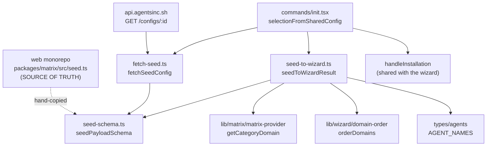

<!-- VALIDATED 2026-08-02 · FULL (product 0.147.1) — new document, no prior basis.
     Every file under src/cli/lib/seed/ read end to end, plus commands/init.tsx's
     `--from` producer and the shared spine, lib/installation/local-installer.ts's
     `resolveStackProperty`, the five e2e/commands/init-from-*.e2e.test.ts specs,
     e2e/fixtures/seed-config-store.ts, and BOTH copies of the vendored schema
     (the CLI's src/cli/lib/seed/seed-schema.ts and the web monorepo's
     packages/matrix/src/seed.ts, which is the source of truth).
     Unit surface verified by RUNNING it: `vitest run src/cli/lib/seed/
     src/cli/lib/__tests__/commands/init-from-plugin-install.test.ts` -> 13 passed. -->

# Seed Contract (`init --from`)

**Last Updated:** 2026-08-02
**Last Validated:** 2026-08-02

> **What this document owns.** The wire contract for configurations shared from agentsinc.sh, its
> version policy, the payload -> `WizardResultV2` mapping, and the `init --from <id>` consumer path.
> It is the only doc that describes `src/cli/lib/seed/`.
>
> **What it deliberately does not own.** `reference/types/zod-schemas.md` scopes itself to
> `src/cli/lib/schemas.ts` by its own first line, so its schema count is narrower than "every Zod
> schema in the CLI" and correctly excludes `seed-schema.ts`. Do not fold this contract into it, and
> do not read its count as covering this file. The union sizes (`AgentName` and friends) are owned by
> `reference/type-system.md`; the install pipeline this path feeds is
> `reference/features/operations-layer.md` and `reference/config/config-writer.md`.

## Module Map

**Directory:** `src/cli/lib/seed/` — three source files, no barrel. Consumers import the leaf modules
directly.

| File                | Exports                                                                                                                                                     | Role                                                               |
| ------------------- | ----------------------------------------------------------------------------------------------------------------------------------------------------------- | ------------------------------------------------------------------ |
| `seed-schema.ts`    | `SEED_VERSION`, `seedPayloadSchema`, `seedSkillSchema`, `seedAgentSchema`, `seedModelSchema`, `seedEffortSchema`, `seedLoadStateSchema`, + 6 inferred types | The vendored wire contract. Zod only; imports nothing from the CLI |
| `fetch-seed.ts`     | `SEED_API_URL`, `SEED_USER_AGENT`, `fetchSeedConfig`, `FetchSeedResult`                                                                                     | Network boundary: fetch, decode, and turn every failure into text  |
| `seed-to-wizard.ts` | `seedToWizardResult`, `SeedMapping`                                                                                                                         | Maps a decoded payload onto the shape the install pipeline eats    |

**`commands/init.tsx` is the sole consumer.** Verified by grep over `src/` and `e2e/`: the only
non-test importers of `lib/seed/` are `init.tsx` (both entry points) and `fetch-seed.ts` itself
(importing the schema). `dependency-graph.md` note 14b records the same edge.



## The Vendoring Rule

**`seed-schema.ts` is a hand-maintained copy. The original lives in the web monorepo at
`packages/matrix/src/seed.ts` and is the source of truth** — that file says so outright, and the CLI
copy's header names it. Both were read this session and agree field for field, enum member for enum
member, on `SEED_VERSION = 3`.

**Why copied rather than depended on:** a published package spanning two repos means versioning and a
release step for forty lines of Zod that no consumer had exercised. The canonical home becomes a
shared package once the contract stops moving (**D-239**, `todo/D-239-web-ui-shared-matrix-package.md`).

> **THE LOCKSTEP RULE — every shape change bumps `SEED_VERSION` in BOTH copies, in the same change.**
>
> The reason is not ceremony: `z.object` **strips what it does not declare**, and both sides parse
> through it.
>
> | Direction                              | What strips the field                                                                            | Symptom                                                                        |
> | -------------------------------------- | ------------------------------------------------------------------------------------------------ | ------------------------------------------------------------------------------ |
> | Web adds a field, CLI copy not updated | The CLI's `seedPayloadSchema.safeParse` drops it during decode                                   | The id installs "successfully" with the new field silently absent              |
> | Web copy behind, CLI ahead             | The worker re-serializes the **validated** payload before hashing, so the field never reaches KV | The id is minted without the field; the CLI cannot recover what was never sent |
>
> A field that survives a round trip is therefore not evidence the contract is in sync — only the
> version literal is. That is why v3 exists at all: `seedAgentSchema.scope` is additive-optional and
> would not normally need a version, but the version is what tells a sharing app the field survives
> the trip.
>
> **Nothing enforces this automatically.** Grep of the CLI's `package.json` and `scripts/` finds no
> seed-sync check, and there is no shared test. The lockstep is a convention held by these two files'
> header comments and by this document. Treat a change to either copy as a change to both.

`seed-schema.ts` imports only `zod` — no CLI type, constant or util. Keep it that way: it is a
transcription of a foreign file, and every import added to it is one more thing to reconcile by hand.

## Version Policy: Discard, Do Not Migrate

| Rule                                                                                                | Where it lives                                    |
| --------------------------------------------------------------------------------------------------- | ------------------------------------------------- |
| `v` is `z.literal(SEED_VERSION)` — **exactly one** accepted version, never a range                  | `seed-schema.ts`                                  |
| A stale id fails to decode **loudly**; there is no migration path, and none is wanted pre-1.0       | `seed-schema.ts` header, mirrored in the web copy |
| A rejected version surfaces as the same message as a malformed body                                 | `fetch-seed.ts`                                   |
| The policy is pinned by a spec that refuses `v: 2` and asserts `["v"]` is the **only** failing path | `seed-schema.test.ts`                             |

**Why one version is safe here, and why it would not be elsewhere.** The worker content-addresses an
id (SHA-256 of the re-serialized validated body, base64url, truncated) and serves it
`cache-control: immutable`. A stored payload therefore can never change shape under its id — so
"re-share it" is always a complete remedy, and there is no half-migrated state a guess would have to
resolve.

**Version history, from the web copy's own comments** (the CLI copy records only v3):

| Version | Change                                                                                                                         |
| ------- | ------------------------------------------------------------------------------------------------------------------------------ |
| v1      | Model and effort lived on the **skill**; agents could only be inferred from assignments, so a skill-less agent was unshareable |
| v2      | Moved model and effort off the skill and onto the **sub-agent**; added `on` so a bare agent can travel                         |
| v3      | Gave the sub-agent its own `scope`. Before it, `--from` wrote `project` for every agent                                        |

## The Wire Contract

### `seedPayloadSchema` — the envelope

| Field           | Type                        | Sparseness / semantics                                                                                                                                                                                                                |
| --------------- | --------------------------- | ------------------------------------------------------------------------------------------------------------------------------------------------------------------------------------------------------------------------------------- |
| `v`             | `z.literal(3)`              | Required. The whole of the version gate                                                                                                                                                                                               |
| `matrixVersion` | `string`                    | Required on the wire, **diagnostics only**. Grep confirms **no CLI code reads it** — not the mapper, not the command, not a test assertion. It exists so a skip can one day be explained; a mismatch must never fail or gate a decode |
| `stackId`       | `string \| null`            | Metadata, not data. The web app always sends the full per-agent expansion alongside it — see [Stack ids](#stack-ids-are-the-one-fatal-unknown)                                                                                        |
| `skills`        | `Record<string, SeedSkill>` | **Sparse — presence is selection.** Keys are full catalog slugs, never positional indices. The web store's `remembered` (deselected) set never leaves the browser                                                                     |
| `agents`        | `Record<string, SeedAgent>` | **Sparse — an agent with nothing to say has no entry.** Presence is a statement, not an install                                                                                                                                       |

### `seedSkillSchema` — one skill row

| Field         | Type                                    | Notes                                                                            |
| ------------- | --------------------------------------- | -------------------------------------------------------------------------------- |
| `install`     | `"plugin" \| "eject"`                   | Required. Maps to `SkillConfig.source` — see the mapping table                   |
| `scope`       | `"project" \| "global"`                 | Required. The **skill's** scope; independent of any agent's scope                |
| `assignments` | `Record<string, "lazy" \| "preloaded">` | Sub-agent id -> load state. **Presence is assignment.** Per `(skill, sub-agent)` |

### `seedAgentSchema` — one sub-agent row

**Every field is optional, and each says something different on its own.** This is the only place a
configuration can speak about an agent that no skill mentions.

| Field    | Type                                              | Absent means                                                                                                                                           |
| -------- | ------------------------------------------------- | ------------------------------------------------------------------------------------------------------------------------------------------------------ |
| `on`     | `boolean`                                         | "whatever the assignments imply". `true` is the **only** way a skill-less agent travels; `false` removes the agent _and_ the assignment rows naming it |
| `model`  | `"opus" \| "fable" \| "sonnet" \| "haiku"`        | "keep whatever the agent's own metadata says"                                                                                                          |
| `effort` | `"low" \| "medium" \| "high" \| "xhigh" \| "max"` | Same                                                                                                                                                   |
| `scope`  | `"project" \| "global"`                           | `project` — the CLI's own default, so a resting choice never has to travel                                                                             |

**An entry naming only a model does NOT switch the agent on.** `readAgentMap` files such an entry
under `known`, and the bare-agent loop admits only `entry.on === true`. Pinned by
`seed-to-wizard.test.ts` ("carries model and effort onto the named agent and leaves an
assignment-only agent bare").

### Enum alignment with the CLI's own unions

| Seed enum             | CLI counterpart                                   | Relationship                                                                                                                                                |
| --------------------- | ------------------------------------------------- | ----------------------------------------------------------------------------------------------------------------------------------------------------------- |
| `seedModelSchema`     | `ModelName` (`MODEL_NAMES`, `types/matrix.ts`)    | **Strict subset.** `MODEL_NAMES` also carries `"inherit"`; the wire has no such member because absence of the key already means "keep the metadata default" |
| `seedEffortSchema`    | `EffortLevel` (`EFFORT_NAMES`, `types/matrix.ts`) | **Exactly equal**, member for member                                                                                                                        |
| `seedLoadStateSchema` | `SkillAssignment.preloaded` (`types/skills.ts`)   | `"preloaded"` -> `true`, `"lazy"` -> `false`. The wire spells as an enum what the stack spells as a boolean                                                 |

Because the model enum is a strict subset, `SeedAgent.model` assigns to `AgentScopeConfig.model`
without a cast. **Adding a member to `MODEL_NAMES` does not widen the wire** — the web copy has to
add it too, under a version bump.

## `fetch-seed.ts` — the network boundary

```
GET ${SEED_API_URL}/configs/${encodeURIComponent(id)}
headers: { accept: "application/json", "user-agent": "agents-inc-cli" }
```

| Export            | Value / signature                                              | Notes                                                                     |
| ----------------- | -------------------------------------------------------------- | ------------------------------------------------------------------------- |
| `SEED_API_URL`    | `process.env.AGENTS_INC_API_URL ?? "https://api.agentsinc.sh"` | **Read once at module load.** See the gotcha below                        |
| `SEED_USER_AGENT` | `"agents-inc-cli"`                                             | The conversion signal — see below                                         |
| `fetchSeedConfig` | `(id: string) => Promise<FetchSeedResult>`                     | `FetchSeedResult = { ok: true; payload } \| { ok: false; error: string }` |

> **`AGENTS_INC_API_URL` is captured at module-load time, not per call.** It is a module-level
> `const`, so mutating `process.env` after the module has been imported has no effect. This is why
> the E2E harness passes the variable into a **spawned process** (`CLI.run` -> `execa("node", [BIN_RUN, ...], { env: { AGENTS_INC_API_URL: store.url } })`,
> `e2e/fixtures/seed-config-store.ts` + `e2e/fixtures/cli.ts`) and why the in-process command test
> stubs global `fetch` instead (`init-from-plugin-install.test.ts`). A unit test that sets the env
> var and then calls `fetchSeedConfig` would silently hit production.

### The user-agent is the conversion signal

`GET /configs/:id` is the **only** point at which either side can observe a config being _installed_
rather than merely built, and the worker cannot separate that from someone opening a share link in a
browser unless the CLI says so. The header is the whole of that discriminator.

Two facts worth keeping straight, both verified against source:

- The CLI **always** sends it; `e2e/commands/init-from-shared-config.e2e.test.ts` pins the exact
  string and the exact path (`/configs/UAcheck1`) against the stub store, which records
  `{ url, userAgent }` per request.
- The worker's `getConfigRoute` handler (`apps/server/src/index.ts` in the web monorepo) **does not
  read it** as of this reading. The header is available to Cloudflare's request logging; nothing in
  the handler computes a metric from it. Do not describe the signal as "measured" — describe it as
  "emitted, and available".

### Failure is a message, never a throw

**Invariant: `fetchSeedConfig` never throws and never rejects.** Every failure is
`{ ok: false, error }` carrying user-facing prose. The reason is positional — this runs _before
anything has been written_, so there is nothing to roll back and the caller's only job is to explain.

| Condition                 | Detected by                    | `error` text                                                                                              |
| ------------------------- | ------------------------------ | --------------------------------------------------------------------------------------------------------- |
| Network unreachable / DNS | `try` around `fetch`           | `Could not reach ${SEED_API_URL} — check your connection.`                                                |
| Unknown id                | `response.status === 404`      | `No configuration found for id '${id}'.`                                                                  |
| Any other non-2xx         | `!response.ok`                 | `Fetching configuration failed (HTTP ${status}).`                                                         |
| Body is not JSON          | `try` around `response.json()` | `The configuration store returned something that is not JSON.`                                            |
| Fails `seedPayloadSchema` | `safeParse`                    | `Configuration '${id}' does not match the expected format — it may have been created by a newer version.` |

**The schema-failure message is deliberately specific about the cause.** The payload was validated by
the worker on the way _in_ (`createConfigRoute` parses with the same schema before hashing), so a
stored payload that no longer parses means the contract moved underneath it — worth saying plainly
rather than reporting a generic failure. **A wrong `v` lands in this same row**: a v1 or v2 id and a
structurally broken body produce the identical sentence, and the version-refusal E2E asserts exactly
that.

## `seed-to-wizard.ts` — the mapping

```typescript
seedToWizardResult(payload: SeedPayload, matrix: MergedSkillsMatrix): SeedMapping
// SeedMapping = { result: WizardResultV2; skippedSkillIds: string[]; skippedAgentNames: string[] }
```

The output is a `WizardResultV2` — the **same** type the wizard produces — so `init --from` reuses
`writeProjectConfig` -> skill install -> `compileAgentsAllScopes` unchanged rather than growing a
second install path that can drift.

### Payload field -> `WizardResultV2` field

| `WizardResultV2` field | Derived from                                                                   | Rule                                                                                                                                                                                                                                                                                      |
| ---------------------- | ------------------------------------------------------------------------------ | ----------------------------------------------------------------------------------------------------------------------------------------------------------------------------------------------------------------------------------------------------------------------------------------- |
| `skills`               | `payload.skills` (surviving entries)                                           | `{ id, scope: entry.scope, source }`. `source` = `"eject"` when `install === "eject"`, else the skill's **primary** `availableSources` entry, else `DEFAULT_PUBLIC_SOURCE_NAME` (`sourceForSkill`, mirroring the wizard's own resolution)                                                 |
| `selectedAgents`       | assignment names on surviving skills **∪** map entries with `on === true`      | De-duplicated via a `Set`; order is insertion order (assignment order first, then bare agents). **Order is not part of the contract** — the specs that care sort                                                                                                                          |
| `agentConfigs`         | `selectedAgents.map(name => agentScopeConfig(name, agentMap.known.get(name)))` | One row per selected agent. `scope` defaults to `"project"`; `model` / `effort` are spread in **only when defined**, so an absent key never becomes an explicit `undefined`                                                                                                               |
| `assignedStack`        | `entry.assignments` per surviving skill                                        | `Partial<Record<AgentName, StackAgentConfig>>`, category-keyed, appended in payload order. `"preloaded"` -> `{ preloaded: true }`. See [assignedStack](#why-assignedstack-exists)                                                                                                         |
| `selectedStackId`      | `payload.stackId`                                                              | Passed through verbatim, including `null`                                                                                                                                                                                                                                                 |
| `domainSelections`     | surviving skills, grouped `domain -> category -> SkillId[]`                    | Domain resolved by `getCategoryDomain(skill.category)`; duplicates suppressed by an `includes` check                                                                                                                                                                                      |
| `selectedDomains`      | `orderDomains(Object.keys(domainSelections))`                                  | Canonical display order (custom domains alphabetically, then `BUILT_IN_DOMAIN_ORDER`) — the same helper the wizard uses                                                                                                                                                                   |
| `unresolvableSkillIds` | — always `[]`                                                                  | **Deliberate.** That field is the D-233 Scenario C guard protecting entries in a _saved config_ the wizard could not represent. Nothing here came from a saved config; the skipped ids came off the wire and are reported to the user directly, so there is no existing entry to preserve |
| `cancelled`            | — always `false`                                                               | There is no interactive step to cancel                                                                                                                                                                                                                                                    |
| `validation`           | — always `{ valid: true, errors: [], warnings: [] }`                           | **Deliberate.** The sharing app already validated the selection, and this path has no interactive step in which a warning could be acted on                                                                                                                                               |
| `matrixVersion`        | — **not mapped**                                                               | Decoded and discarded. No reader anywhere in `src/`                                                                                                                                                                                                                                       |

### Skip, do not fail

**Invariant: an id the catalog does not know is skipped and reported; it never fails the decode.**
Payloads carry catalog slugs precisely so they survive catalog churn — a config shared before a skill
was renamed should still install everything else, and failing the whole decode would make every
rename retroactively break every shared id.

| Input                                                                  | Outcome                                                                                                                                                                                                                                            | Recorded in                                      |
| ---------------------------------------------------------------------- | -------------------------------------------------------------------------------------------------------------------------------------------------------------------------------------------------------------------------------------------------- | ------------------------------------------------ |
| Skill id absent from `matrix.skills`                                   | Skipped whole, with its assignment rows                                                                                                                                                                                                            | `skippedSkillIds`                                |
| Skill whose category has no domain (incl. the `local` pseudo-category) | Skipped — `getCategoryDomain` reads `matrix.categories[category]?.domain`, and `local` is never registered there: `source-loader.ts` explicitly excludes it when synthesizing categories for local skills, and it is not a `Category` union member | `skippedSkillIds`                                |
| Agent name in `payload.agents` not in `AGENT_NAMES`                    | Dropped                                                                                                                                                                                                                                            | `skippedAgentNames`                              |
| Agent name in an `assignments` key not in `AGENT_NAMES`                | Assignment row dropped                                                                                                                                                                                                                             | `skippedAgentNames`                              |
| Agent with `on: false`                                                 | Dropped, **and every assignment row naming it is ignored too**                                                                                                                                                                                     | Neither — it is not a skip, it is an instruction |

`skippedAgentNames` is accumulated in a `Set` (seeded from `readAgentMap`'s `unknown` list) and
spread to an array at the end, so a name unknown in both the map and an assignment is reported once.
`skippedSkillIds` is a plain array — a skill id can only appear once, since `payload.skills` is keyed
by it.

> **The two "unknown" checks read different registries, and this asymmetry is intentional but easy to
> misread.** Unknown **skills** are decided against the **runtime** matrix (`matrix.skills`, the
> merged matrix for the loaded source), so the same payload can skip different ids against different
> sources. Unknown **agents** are decided against `AGENT_NAMES`, which is re-exported from
> `types/generated/source-types.ts` — a **build-time** generated union (`bun run generate:types`).
> A custom agent that exists only in a runtime source is therefore not "known" to this mapper.

#### Stack ids are the one fatal unknown

`selectedStackId` is passed through untouched, and downstream `buildEjectConfig`
(`lib/installation/local-installer.ts`) resolves it with `loadStackById`, which falls back to the
CLI's built-in defaults and returns `null` when neither has it — at which point **`buildEjectConfig`
throws** `Stack '<id>' not found in config/stacks.ts`.

**So an unresolvable `stackId` is fatal, while an unresolvable skill id or agent name is not.** This
is the single exception to the skip-don't-fail policy, it lives outside `lib/seed/`, and **no spec in
the seed family covers it** (the curation E2E publishes a `stackId` the E2E source does have). Treat
it as a known gap, not as designed behaviour.

What a resolvable stack id actually does is narrow: it supplies `description` to the written config
and overlays the stack YAML's `preloaded` flags as `existingStack` — and its own expansion is then
**discarded** by `resolveStackProperty`, because overlaying it would add back the skills and agents
the payload's assignments deliberately left out. The curation E2E asserts the written `config.stack`
in full for exactly this reason, and its inline comment warns against simplifying the spec down to
the frontmatter half — the frontmatter assertions pass even when every sub-agent holds every skill.

### `agentScopeConfig` — the project default

```typescript
function agentScopeConfig(name: AgentName, entry: SeedAgent | undefined): AgentScopeConfig {
  return {
    name,
    scope: entry?.scope ?? "project",
    ...(entry?.model !== undefined && { model: entry.model }),
    ...(entry?.effort !== undefined && { effort: entry.effort }),
  };
}
```

Three properties, all pinned by `seed-to-wizard.test.ts` ("scopes each sub-agent by its own entry"):

1. **Where a sub-agent's front-matter is written is the payload's to say, per agent, independently of
   any skill's scope.** A globally-scoped agent moves the agent, never the skills around it — the
   agent-scope E2E asserts the global config holds the agent and `skills: []`.
2. **"Has an entry" is not what decides the scope — naming one is.** An entry carrying only
   `{ model: "haiku" }` still resolves to `scope: "project"`.
3. **An absent optional key is omitted, not set to `undefined`.** The conditional spread is what makes
   `toStrictEqual` against a factory-built `AgentScopeConfig` meaningful; a `{ model: undefined }` row
   would compare unequal and, worse, would write an explicit override into the config.

### Why assignedStack exists

`WizardResultV2.assignedStack` is **optional and the wizard never sets it.** It exists for this
producer alone.

The `assignments` map is per `(skill, sub-agent)` and carries a load state, so it decides three
things the wizard cannot express separately:

- which sub-agents are selected,
- which skills land in each one's stack entry,
- which of those preload.

Without it, the install pipeline's ownership rules would broadcast **every scope-compatible skill to
every selected agent** — handing a bare sub-agent someone else's skills and destroying exactly the
curation a shared configuration exists to carry. Ownership rules also inherit `preloaded` from a
prior or stack-YAML entry, which is silent about what the sharer chose.

**Consumption point:** `resolveStackProperty(generated, assigned)` in
`lib/installation/local-installer.ts` — `generated && assigned ? assigned : generated`. The assigned
stack **replaces** the ownership-derived one rather than merging with it. The `generated &&` half is
load-bearing: with no agents selected there is nothing to own, and the **absent** key is what tells
the merger to leave the stack already on disk alone.

`buildEjectConfig` is reached for every install mode (`buildAndMergeConfig` calls it unconditionally,
despite the name), so plugin, eject and mixed payloads all route through `resolveStackProperty`.

## The `init --from` Consumer Path

**Flag:** `--from <id>` on `init` (`src/cli/commands/init.tsx`), described as
_"Install a configuration shared from agentsinc.sh by its id, without the wizard"_, `helpValue: "<id>"`.
`--source` and `--refresh` still apply — the producer takes the same `SourceRefreshFlags`.

> **This flag is currently absent from `reference/commands/index.md`'s `init` flag table.** That table
> lists only `--refresh` and `--source`. Reported, not fixed here — see [Cross-Surface Defects](#cross-surface-defects-reported-not-fixed).

### One spine, two producers

`Init.run` chooses a producer and then runs a single shared install sequence. The two producers
differ only in _where the selection comes from_.

| Step                     | `selectionFromWizard`                                           | `selectionFromSharedConfig`                                                                                                                          |
| ------------------------ | --------------------------------------------------------------- | ---------------------------------------------------------------------------------------------------------------------------------------------------- |
| Dashboard diversion      | Applies                                                         | **Bypassed** — `if (!flags.from && ...)`. An id is an explicit instruction to install _that_ configuration, so it overrides an existing installation |
| Order of operations      | source load ∥ global config load, then wizard                   | **fetch first**, then `loadSourceOrFail`                                                                                                             |
| Return type              | `Promise<Selection \| null>` (`null` -> `EXIT_CODES.CANCELLED`) | `Promise<Selection>` — there is nothing to cancel; a fetch failure exits `EXIT_CODES.ERROR` at the point of failure                                  |
| `Selection.interactive`  | `true`                                                          | `false`                                                                                                                                              |
| `Selection.emptyMessage` | `"No skills selected"`                                          | `` `Configuration '${id}' contains no skills this catalog can install.` ``                                                                           |

**The fetch precedes the source load on purpose.** An unknown id must fail before anything is loaded
or written; the E2E asserts `.claude-src` does not exist after a 404.

`Selection` carries `interactive` and `emptyMessage` as **values rather than a downstream flag
branch** — that is what stops the two paths growing separate copies of the install sequence.

### What the shared spine does with `interactive: false`

The post-install permission notice is an Ink app with no exit of its own, so `waitUntilExit()` only
ever resolves because a person is there to end it. `handleInstallation` therefore renders one frame
and calls `unmount()` immediately when `interactive` is false. **`init --from` must complete over a
pipe and in CI; awaiting that notice would hang it.**

### Reporting

| Condition                      | Output                                                                     |
| ------------------------------ | -------------------------------------------------------------------------- |
| Always, first                  | `Fetching configuration ${id}...` (`this.log`)                             |
| `skippedSkillIds.length > 0`   | `this.warn`: `Skipped N skill(s) this catalog does not know: <ids joined>` |
| `skippedAgentNames.length > 0` | `this.warn`: `Skipped N unknown sub-agent(s): <names joined>`              |
| `result.skills.length > 0`     | `Installing N skill(s) across M sub-agent(s)`                              |
| Fetch failed                   | `this.error(fetched.error, { exit: EXIT_CODES.ERROR })`                    |
| Nothing installable            | `this.error(selection.emptyMessage, { exit: EXIT_CODES.ERROR })`           |

**Skips are named, not counted.** "3 skills were skipped" cannot be acted on; the ids can, and this
is the one moment the user can tell whether what they shared is what they are getting. The E2E
asserts the _name_ appears in output, and `e2e/fixtures/seed-config-store.ts` exports
`flattenCliOutput` because oclif wraps warning text at terminal width with a `›` continuation
prefix — asserting on a short fragment instead would pass on a truncated message.

**The empty guard is `skills.length === 0 && selectedAgents.length === 0`.** A sub-agent is
installable on its own — it has front-matter, a prompt and a compiled file without owning a single
skill — so only a selection with neither is nothing to install. (`reference/commands/index.md` still
documents the older skills-only guard; see [Cross-Surface Defects](#cross-surface-defects-reported-not-fixed).)

## Test Surface

### Unit / command tests

Verified by running them: `vitest run src/cli/lib/seed/ src/cli/lib/__tests__/commands/init-from-plugin-install.test.ts`
-> **13 passed**, 3 files. **This document owns these three numbers.**

| Spec file                                                         | Specs | Covers                                                                                                                               |
| ----------------------------------------------------------------- | ----- | ------------------------------------------------------------------------------------------------------------------------------------ |
| `src/cli/lib/seed/seed-schema.test.ts`                            | 4     | The wire contract, pinned against **literals** rather than the factories                                                             |
| `src/cli/lib/seed/seed-to-wizard.test.ts`                         | 6     | The four ways an agent reaches (or fails to reach) the result: named by the map, named only by an assignment, switched off, not real |
| `src/cli/lib/__tests__/commands/init-from-plugin-install.test.ts` | 3     | The shared install spine: ref + scope per plugin skill, and install-before-config-write ordering                                     |

> **`seed-schema.test.ts` pins literals on purpose.** A version test that builds its payload from
> `SEED_VERSION` follows the constant wherever it goes and **can never fail** — the canonical shape of
> findings Pattern V (the artefact that looks like verification and cannot fail). The same reasoning
> is why `init-from-shared-config.e2e.test.ts` hardcodes `v: 3` in its own `seedPayload` helper while
> the _scenario_ specs, which are not testing the contract, use `buildSeedPayload`.
>
> Its `toStrictEqual` on the whole agent entry (rather than a key-existence check) is the second half
> of the same idea: `z.object` strips undeclared keys, so a schema that merely _tolerated_ `scope`
> would pass an existence check while dropping the value.

**Factories:** `src/cli/lib/__tests__/factories/seed-factories.ts` — `buildSeedPayload(overrides?)`
and `buildSeedSkill(overrides?)`. Both default to the sparse/empty shape (`skills: {}`, `agents: {}`,
`assignments: {}`, `stackId: null`) because sparse is the contract's resting state.
`buildSeedSkill` defaults `install: "eject"` — a test source is local and has no marketplace, so
plugin mode legitimately refuses it, and that is a different error path.

**Seam choice in `init-from-plugin-install.test.ts`, worth preserving:** the only mock below the spine
is `claudePluginInstall` in `utils/exec.js`. `installPluginSkills` and `pluginInstallFailureError` are
deliberately **not** overridden — they are the spine. `fetch` is stubbed via `vi.stubGlobal` rather
than mocking `fetch-seed`, which keeps the schema decode and the seed -> wizard mapping real.

### E2E family

**Fixture:** `e2e/fixtures/seed-config-store.ts` — `startSeedConfigStore()` runs a **real** loopback
HTTP server on an ephemeral port that mirrors the worker (`GET /configs/<id>`, 404 for an unpublished
id) and records `{ url, userAgent }` per request. A string payload is served **verbatim** so a spec
can pin a body the schema must refuse. It is a real server rather than a module mock because these
specs exist to cover the whole path; a mocked fetch would skip the two seams most likely to break —
the flag reaching the command, and the payload surviving the wire. `runInitFrom(store, id, project, sourceDir)`
is the runner; it injects `AGENTS_INC_API_URL` into the spawned process's environment.

| Spec file (`e2e/commands/`)                | Specs | Covers                                                                                                                                                                                                                                                                                              |
| ------------------------------------------ | ----- | --------------------------------------------------------------------------------------------------------------------------------------------------------------------------------------------------------------------------------------------------------------------------------------------------- |
| `init-from-shared-config.e2e.test.ts`      | 11    | **Wire contract and command plumbing.** Install without the wizard; the user-agent + exact request path; skip-by-name; 404 with nothing written; malformed body; v1 refusal; model/effort onto compiled agent _and_ config; a bare switched-on agent; nothing-installable error; dashboard override |
| `init-from-scenarios-install.e2e.test.ts`  | 5     | Per-skill scope routing, skipped skills **and** agents together, `on: false` dropping its assignment rows, mixed plugin+eject from one payload, a global plugin skill at `user` scope when run in `$HOME`                                                                                           |
| `init-from-scenarios-curation.e2e.test.ts` | 5     | Per-sub-agent curation: stack payload as its own expansion, per-agent assignment + load state, a switched-on agent holding nothing, a skills-free payload, exclusive vs non-exclusive category emission                                                                                             |
| `init-from-scenarios-tuning.e2e.test.ts`   | 5     | Every model the contract allows, every effort, an unnamed field left alone, no-entry defaults, and re-tuning when a second id installs over the first                                                                                                                                               |
| `init-from-agent-scope.e2e.test.ts`        | 1     | A globally-scoped sub-agent compiles into `$HOME` and a project-scoped one into the project; **exhaustive** directory listings, not `contains`                                                                                                                                                      |

**27 executable specs across the 5 files. This document owns that number and the per-file column.**
Counting by `it(` is safe _here_ specifically because grep confirms **no `it.each` or `describe.each`
anywhere in the family** — the trap that made the config-gate guard-test count wrong does not apply.
The `e2e/commands/` directory **file** count is owned by `reference/testing/e2e-infrastructure.md`;
do not restate it here.

**The division of labour between these files is deliberate and stated in the shared-config spec's own
header:** wire contract and command plumbing live in `init-from-shared-config`; what a _decoded_
payload turns into on disk lives in the `init-from-scenarios-*` specs. A new contract-level assertion
belongs in the former.

## D-305 — the plugin-install scare

**"`init --from` never installs plugins" was investigated and closed with no product change: it was
not reproducible on current source, and the reported run turned out to be a pre-refactor local build
whose `--from` producer skipped the plugin leg entirely (the published CLI had no `--from` at all).**
`todo/TODO-completed.md` carries the full entry. Hardening landed anyway, so the green cannot lie
again: `toHavePluginInRegistry` now requires the install path to exist and hold
`skills/<id>/SKILL.md`; the scenario E2Es gained content, `enabledPlugins` and output assertions plus
a home-scope variant; and `init-from-plugin-install.test.ts` drift-locks that every plugin skill
reaches `claudePluginInstall` at its mapped scope and that the config write never precedes a
successful install.

The two invariants that test now pins are worth stating on their own, because neither is observable
from outside:

- **Scope mapping.** A payload `scope: "global"` reaches the Claude CLI as `"user"`; `"project"`
  stays `"project"`. The ref and scope decide which registry key a later `uninstall` owns, so a skill
  installed at the wrong scope uninstalls from the wrong place.
- **Install gates the config write.** A failed plugin install hard-errors _before_ `writeProjectConfig`
  runs, so no `config.ts` is left claiming a skill is installed that is not. Asserted both by call
  ordering (`invocationCallOrder`) and by the absence of the file on disk.

## Known Limitations

| Limitation                                                                           | Consequence                                                                                                                                                                  |
| ------------------------------------------------------------------------------------ | ---------------------------------------------------------------------------------------------------------------------------------------------------------------------------- |
| No automated check that the two copies of the schema agree                           | A one-sided edit silently strips a field; only the version literal would show it                                                                                             |
| An unresolvable `stackId` throws from `buildEjectConfig`, unlike every other unknown | Untested; the one fatal unknown in an otherwise skip-don't-fail contract                                                                                                     |
| `matrixVersion` has no reader                                                        | The field cannot currently explain a skip, which is the reason it is on the wire                                                                                             |
| `SEED_API_URL` is captured at module load                                            | Any in-process test that sets `AGENTS_INC_API_URL` after import hits production                                                                                              |
| The CLI validates nothing about the id's shape                                       | Any string is URL-encoded and sent; the worker's 8-char content-addressed form is not enforced client-side (`encodeURIComponent` is the injection guard, not a format check) |

## Cross-Surface Defects Reported, Not Fixed

Found while writing this document, in files this document does not own. Recorded here rather than
patched, per the ownership rule — and recorded at all because a defect nobody wrote down is a defect
the next pass re-discovers.

| Surface                       | Defect                                                                                                                                                                                                                                                                     | Owner        |
| ----------------------------- | -------------------------------------------------------------------------------------------------------------------------------------------------------------------------------------------------------------------------------------------------------------------------- | ------------ |
| `reference/commands/index.md` | `init`'s flag table lists only `--refresh` and `--source`. **`--from <id>` is missing entirely** — the flag has no coverage in the canonical commands reference                                                                                                            | codex-keeper |
| `reference/commands/index.md` | Its `init` flow step 4 states the empty guard as `if (result.skills.length === 0)` with the message `"No skills selected"`. **Both are now false**: the guard is `skills.length === 0 && selectedAgents.length === 0`, and the message comes from `Selection.emptyMessage` | codex-keeper |
| `reference/commands/index.md` | The `init` flow describes one producer. It is now **two producers on one spine** (`selectionFromWizard` / `selectionFromSharedConfig`), and the flow reads as if the wizard were unconditional                                                                             | codex-keeper |
| `reference/boundary-map.md`   | Has **no entry for the seed fetch**. It is a network-sourced, schema-validated external input reached from a command — the exact shape that doc enumerates for file and shell inputs                                                                                       | codex-keeper |

## Related Documentation

- [`reference/commands/index.md`](../commands/index.md) — the `init` command, its flow and its other flags
- [`reference/features/wizard-flow.md`](./wizard-flow.md) — the other producer of `WizardResultV2`
- [`reference/features/plugin-system.md`](./plugin-system.md) — what `installPluginSkills` does with the mapped scope
- [`reference/features/operations-layer.md`](./operations-layer.md) — `writeProjectConfig`, `compileAgentsAllScopes`
- [`reference/config/config-writer.md`](../config/config-writer.md) — where the mapped config is written, and the gate
- [`reference/concepts/scope-system.md`](../concepts/scope-system.md) — project vs global, the CLI-side model
- [`reference/types/core-types.md`](../types/core-types.md) — `SkillConfig`, `AgentScopeConfig`, `SkillAssignment`, `StackAgentConfig`
- [`reference/types/zod-schemas.md`](../types/zod-schemas.md) — the CLI's _other_ Zod schemas; scoped to `lib/schemas.ts` and does **not** cover this file
- [`reference/dependency-graph.md`](../dependency-graph.md) — note 14b, the `init` -> `lib/seed/` edge
