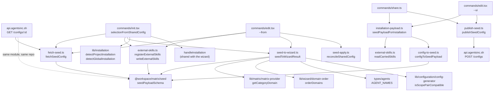

# Seed Contract (`init --from`, `share`, `edit --ui`, `edit --from`)

> **What this document owns.** The wire contract for configurations shared from agentsinc.sh, its
> version policy, both mappings across it — payload -> `WizardResultV2` for `init --from <id>` and
> `edit --from <id>`, and `ProjectConfig` -> payload for `share` and `edit --ui` — the content a
> payload carries inline, and both network boundaries. It is the only doc that describes
> `src/cli/lib/seed/`.
>
> `edit`'s own flow, flags, confirm and apply sequence are
> [`reference/commands/edit.md`](../commands/edit.md); what is here is the contract those two flags
> speak.
>
> **What it deliberately does not own.** The schema module itself lives in another workspace —
> `packages/matrix/src/seed.ts`, imported as `@workspace/matrix/seed` — and this doc describes the
> contract it declares, not that package's other exports. `reference/types/zod-schemas.md` scopes
> itself to `src/cli/lib/schemas.ts` by its own first line, so its schema count covers neither this
> contract nor that package; do not fold this contract into it. The union sizes (`AgentName` and
> friends) are owned by `reference/type-system.md`; the install pipeline this path feeds is
> `reference/features/operations-layer.md` and `reference/config/config-writer.md`; how the package
> reaches `dist/` is `reference/build-and-packaging.md`.

## Module Map

**Directory:** `src/cli/lib/seed/` — seven modules and their seven specs, no barrel. Consumers import
the leaf modules directly. **The schema is not one of them:** it is imported from
`@workspace/matrix/seed`, and this package holds no copy of it.

| Module                                                   | Exports                                                                                                                                                                                                                                                                                                                                                                                                                                                                                                                                      | Role                                                                                                                      |
| -------------------------------------------------------- | -------------------------------------------------------------------------------------------------------------------------------------------------------------------------------------------------------------------------------------------------------------------------------------------------------------------------------------------------------------------------------------------------------------------------------------------------------------------------------------------------------------------------------------------- | ------------------------------------------------------------------------------------------------------------------------- |
| `@workspace/matrix/seed` (`packages/matrix/src/seed.ts`) | `SEED_VERSION`, `MAX_EXTERNAL_SKILL_BYTES`, `seedPayloadSchema`, `installableSeedPayloadSchema`, `seedSkillSchema`, `seedAgentSchema`, `seedModelSchema`, `seedEffortSchema`, `seedLoadStateSchema`, `seedScopeSchema`, `seedSkillTreeSchema`, `seedExternalSkillSchema`, `isSeedScopePairWritable`, `seedAgentScope`, `unwritableSeedAssignments`, + 10 inferred types (`SeedModel`, `SeedEffort`, `SeedLoadState`, `SeedScope`, `SeedSkill`, `SeedAgent`, `SeedSkillTree`, `SeedExternalSkill`, `SeedPayload`, `UnwritableSeedAssignment`) | The wire contract, in the single package every side of it reads                                                           |
| `src/cli/lib/seed/fetch-seed.ts`                         | `SEED_API_URL`, `SEED_USER_AGENT`, `fetchSeedConfig`, `FetchSeedResult`                                                                                                                                                                                                                                                                                                                                                                                                                                                                      | Network boundary: fetch, decode, and turn every failure into text                                                         |
| `src/cli/lib/seed/publish-seed.ts`                       | `publishSeedConfig`, `PublishSeedResult`                                                                                                                                                                                                                                                                                                                                                                                                                                                                                                     | Outbound boundary: POST the payload, return the minted id                                                                 |
| `src/cli/lib/seed/seed-to-wizard.ts`                     | `seedToWizardResult`, `SeedMapping`                                                                                                                                                                                                                                                                                                                                                                                                                                                                                                          | Maps a decoded payload onto the shape the install pipeline eats                                                           |
| `src/cli/lib/seed/config-to-seed.ts`                     | `configToSeedPayload`, `isInstalled`                                                                                                                                                                                                                                                                                                                                                                                                                                                                                                         | The inverse: an installed `ProjectConfig` plus its carried content, mapped onto a payload                                 |
| `src/cli/lib/seed/installation-payload.ts`               | `seedPayloadForInstallation`, `skillsAuthoredHere`, `InstallationPayload`                                                                                                                                                                                                                                                                                                                                                                                                                                                                    | Read, judge ownership, read content, map, refuse — the whole outbound half in one call, shared by `share` and `edit --ui` |
| `src/cli/lib/seed/external-skills.ts`                    | `registerExternalSkills`, `writeExternalSkills`, `readCarriedSkills`, `ExternalSkillInstall`, `ContentReading`, `OwnedSkillDir`                                                                                                                                                                                                                                                                                                                                                                                                              | The content half, both directions: seat + write what a payload carries, read it back out                                  |
| `src/cli/lib/seed/seed-apply.ts`                         | `reconcileSharedConfig`, `KeptFromRoundTrip`, `ReconciledSharedConfig`, `ReconcileOptions`                                                                                                                                                                                                                                                                                                                                                                                                                                                   | Puts back what a destructive apply may not remove, before the diff is taken                                               |

**Three edges, two directions.** `commands/init.tsx` reads a payload; `commands/share.ts` writes
one; `commands/edit.tsx` does both — `--ui` writes (`installation-payload` -> `publish-seed`) and
`--from` reads (`fetch-seed` -> `external-skills` -> `seed-to-wizard` -> `seed-apply`). Nothing else
under `src/` or `e2e/` imports `lib/seed/`. `dependency-graph.md` note 14b records the read edge.



## One Schema, One Home

**`packages/matrix/src/seed.ts` is the only copy of this contract in the repository.** Every side of
the wire imports that one module:

| Importer                                            | Imports                                                                                                 | Why it is on this list                                                                                                                                                                                                                                                                              |
| --------------------------------------------------- | ------------------------------------------------------------------------------------------------------- | --------------------------------------------------------------------------------------------------------------------------------------------------------------------------------------------------------------------------------------------------------------------------------------------------- |
| `src/cli/lib/seed/fetch-seed.ts`                    | `seedPayloadSchema`, `SeedPayload`                                                                      | Decodes the fetched body                                                                                                                                                                                                                                                                            |
| `src/cli/lib/seed/seed-to-wizard.ts`                | `SeedAgent`, `SeedLoadState`, `SeedPayload` (type-only)                                                 | Maps the decoded payload                                                                                                                                                                                                                                                                            |
| `src/cli/lib/seed/config-to-seed.ts`                | `SEED_VERSION`, `seedModelSchema`, `seedPayloadSchema`                                                  | Mints a payload, and `parse`s rather than merely assembles it                                                                                                                                                                                                                                       |
| `src/cli/lib/seed/external-skills.ts`               | `seedExternalSkillSchema`; `SeedExternalSkill`, `SeedPayload`, `SeedSkill`, `SeedSkillTree` (type-only) | Both content directions validate against the contract's own schema rather than restated rules                                                                                                                                                                                                       |
| `src/cli/lib/seed/installation-payload.ts`          | `SeedPayload` (type-only)                                                                               | Returns the payload it minted, with what it will install counted off it                                                                                                                                                                                                                             |
| `src/cli/lib/seed/publish-seed.ts`                  | `SeedPayload` (type-only)                                                                               | Posts it                                                                                                                                                                                                                                                                                            |
| `src/cli/commands/init.tsx`                         | `SeedPayload` (type-only)                                                                               | Threads a decoded payload through its `--from` producer                                                                                                                                                                                                                                             |
| `src/cli/commands/edit.tsx`                         | `SeedPayload` (type-only)                                                                               | The same, for its own `--from` producer                                                                                                                                                                                                                                                             |
| `src/cli/lib/seed/config-to-seed.test.ts`           | `SEED_VERSION`, `seedPayloadSchema`                                                                     | Asserts the minted envelope is one the contract's own schema accepts                                                                                                                                                                                                                                |
| `src/cli/lib/seed/external-skills.test.ts`          | `SeedExternalSkill` (type-only)                                                                         | Builds the entries a payload carries                                                                                                                                                                                                                                                                |
| `src/cli/lib/seed/installation-payload.test.ts`     | `MAX_EXTERNAL_SKILL_BYTES`, `SEED_VERSION`, `SeedExternalSkill`                                         | Pins the weight refusal against the contract's own limit, never a restated number                                                                                                                                                                                                                   |
| `src/cli/lib/__tests__/commands/share.test.ts`      | `SEED_VERSION`                                                                                          | Pins the version the command's posted body carries                                                                                                                                                                                                                                                  |
| `src/cli/lib/seed/seed-schema.test.ts`              | `seedPayloadSchema`                                                                                     | The CLI's contract test — see Test Surface                                                                                                                                                                                                                                                          |
| `src/cli/lib/__tests__/factories/seed-factories.ts` | `SEED_VERSION`; `SeedExternalSkill`, `SeedPayload`, `SeedSkill`                                         | Builds payloads from the same constant the schema pins                                                                                                                                                                                                                                              |
| `apps/server/src/index.ts`                          | `SEED_VERSION`, `seedPayloadSchema`, `installableSeedPayloadSchema`                                     | POST validates with the INSTALLABLE schema before content-addressing the id; GET re-validates what it serves with the base one — see [Two schemas](#two-schemas-one-for-reading-one-for-writing). `SEED_VERSION` is named in the 409 body so the sentence cannot drift from the literal it is about |

Outside this package the same module is imported by `apps/editor/e2e/support/sharing.ts`,
`apps/server/src/index.test.ts` and `packages/api-mocks/src/{fixtures,handlers}.ts`. `src/cli/commands/share.ts`
is **not** on the list: it counts nothing itself — `seedPayloadForInstallation` returns the counts
with the payload.

`packages/matrix` is chosen over the CLI because its consumers — `apps/editor` and `apps/server` —
run in a browser and a Worker, and cannot depend on a package that drags oclif, Ink and `node:fs`.
The dependency direction only goes one way: the CLI reaches into the matrix package, never the
reverse.

> **There is NO vendored copy of this schema, and a claim that there is one has already misled a
> wire-contract change.** The `generate:matrix` script that writes `packages/matrix/src/vendor/` runs
> the other direction — it copies the CLI's own types INTO that package and never emits `seed.ts`. If
> you meet a sentence saying the CLI vendors the seed schema, it is wrong wherever it is written;
> `packages/matrix/src/seed.ts`'s own header states the rule and the reason.

### How the schema reaches a published CLI

`@workspace/matrix` is **private, unpublished and ships TypeScript**, so nothing it exports can be
resolved at runtime from an installed tarball. Two settings make that safe, and they are a pair:

| Setting                                                   | Where                       | Effect                                                       |
| --------------------------------------------------------- | --------------------------- | ------------------------------------------------------------ |
| `"@workspace/matrix": "workspace:*"` in `devDependencies` | `packages/cli/package.json` | Never installed alongside the published package              |
| `noExternal: ["@workspace/matrix"]`                       | `tsup.config.ts`            | Bundles its source into `dist/` instead of leaving an import |

Verified against a built tree: `dist/chunk-*.js` carries the schema's Zod calls inline, its
sourcemap names `../../matrix/src/seed.ts` among its sources, and **no emitted `.js` contains the
specifier `@workspace/matrix`**.

**Promoting it to `dependencies` silently externalises it** — tsup bundles devDependencies by default
and leaves `dependencies` alone — and `init --from` then fails at import time in the published CLI
while every local gate stays green. `tsup.config.ts` carries the same warning inline. Packaging
detail: [`reference/build-and-packaging.md`](../build-and-packaging.md).

### The version rule, and what enforces it

> **Every shape change bumps `SEED_VERSION`.**
>
> With one copy there is no second file to strip a field the first declares, but the two ends of the
> wire still run different builds: a published CLI carries the schema **inlined at build time**, so
> a field added to the package reaches an installed CLI only when a new version is published. In the
> meantime `z.object` strips what that build does not declare. A field surviving a round trip is
> therefore still not evidence the two ends agree — only the version literal is.
>
> That is why the last three versions exist at all: `seedAgentSchema.scope` (v3), the envelope's
> `marketplace` (v4) and the envelope's `external` (v5) are all additive-optional and would not
> normally need a version, but the version is what tells a sharing app the field survives the trip.
> For `external` the stakes are higher than for the other two: a consumer built against v4 would
> STRIP it and install a configuration quietly missing the skills the sharer picked, which is the
> same defect the field exists to fix, moved one step later.

**What enforces it, and what does not.** `seed-schema.test.ts` hardcodes `v: 5` in its payload and
asserts `v: 4` is refused, so **changing `SEED_VERSION` without editing that spec fails the suite** —
the bump cannot happen silently. A shape change _without_ a bump still passes; nothing detects that,
and it is listed under Known Limitations.

`packages/matrix/src/seed.ts` imports only `zod`. Keep it that way: the browser and Worker builds
that read it can carry no CLI runtime.

## Version Policy: Discard, Do Not Migrate

| Rule                                                                                                | Where it lives                         |
| --------------------------------------------------------------------------------------------------- | -------------------------------------- |
| `v` is `z.literal(SEED_VERSION)` — **exactly one** accepted version, never a range                  | `packages/matrix/src/seed.ts`          |
| A stale id fails to decode **loudly**; there is no migration path, and none is wanted pre-1.0       | `packages/matrix/src/seed.ts` header   |
| A rejected version surfaces as the same message as a malformed body                                 | `src/cli/lib/seed/fetch-seed.ts`       |
| That holds for READING. On the WRITE side a rejected version is told apart — 409 and a reload       | `apps/server/src/index.ts`             |
| The policy is pinned by a spec that refuses `v: 3` and asserts `["v"]` is the **only** failing path | `src/cli/lib/seed/seed-schema.test.ts` |

**Why one version is safe here, and why it would not be elsewhere.** The worker content-addresses an
id (SHA-256 of the re-serialized validated body, base64url, truncated) and serves it
`cache-control: immutable`. A stored payload therefore can never change shape under its id — so
"re-share it" is always a complete remedy, and there is no half-migrated state a guess would have to
resolve.

### A wrong `v` on the write side is 409, not 400

Discard-don't-migrate is right for READING an old id and was never the whole story for WRITING, and
the difference is who the writer is. A reader is a CLI run someone started a second ago; a writer is
a **browser tab that may have been open since before the last deploy**. It mints the version it was
BUILT with, its own bundled schema accepts that, and the deployed worker refuses it — on that click
and on every click after it, until the page is reloaded.

`POST /configs` therefore answers a payload whose `v` is not this worker's with **409** and a body
naming the reload, instead of folding it into the 400 a malformed body gets. Nothing about the
schema moved: `v` is still `z.literal(SEED_VERSION)` and the payload is still refused.

| Where                                                    | What it does                                                                                                                                                                                  |
| -------------------------------------------------------- | --------------------------------------------------------------------------------------------------------------------------------------------------------------------------------------------- |
| `apps/server/src/index.ts` -> `namesAnotherSeedVersion`  | True when the validation error carries an issue on path `["v"]` — an older version, a newer one and a missing `v` all land there, because `z.literal` spends one issue on all three           |
| `apps/server/src/index.ts` -> `refuseAnotherSeedVersion` | The POST's validation hook. Returns the 409 for that case and **nothing** otherwise, which hands the request back to the validator's own 400 — so it only ever narrows                        |
| `apps/editor/src/lib/api/configs.ts` -> `ShareRefusal`   | Turns the status into `out-of-date`, one of three refusals the editor tells apart. Reported to Sentry under its own name, since a stale-tab count rises after a release and decays on its own |

**Only the POST.** `GET /configs/:id` is unchanged: what it serves was validated on the way in and is
immutable under a content-addressed id, so a stored payload that no longer parses is an integrity
failure of the worker's own (500), not a version negotiation. The CLI's read-side message is
unchanged too — see [Failure is a message, never a throw](#failure-is-a-message-never-a-throw) — a CLI is
not a long-lived tab and re-sharing is still the one remedy true of every cause.

**Version history, from the schema's own comments:**

| Version | Change                                                                                                                                                                                                                                                                                                                                                                                                  |
| ------- | ------------------------------------------------------------------------------------------------------------------------------------------------------------------------------------------------------------------------------------------------------------------------------------------------------------------------------------------------------------------------------------------------------- |
| v1      | Model and effort lived on the **skill**; agents could only be inferred from assignments, so a skill-less agent was unshareable                                                                                                                                                                                                                                                                          |
| v2      | Moved model and effort off the skill and onto the **sub-agent**; added `on` so a bare agent can travel                                                                                                                                                                                                                                                                                                  |
| v3      | Gave the sub-agent its own `scope`. Before it, `--from` wrote `project` for every agent                                                                                                                                                                                                                                                                                                                 |
| v4      | Gave the payload the **marketplace** its skills are fetched from. An id names whose skill it is (a marketplace's name is the author-time prefix on every id it ships) but cannot say WHERE that marketplace lives; absent still means the default public catalogue                                                                                                                                      |
| v5      | Made the payload carry **content**. Every id above it is resolved by the receiver against a catalogue it already has; a skill added from outside answers to no catalogue, so its whole directory travels inline under `external`. That is what makes a shared id self-contained — `--from` reaches into no third-party repository at install time, and two people installing one id get identical bytes |

## The Wire Contract

### Two schemas, one for reading and one for writing

`seedPayloadSchema` says a payload is WELL-FORMED. `installableSeedPayloadSchema` says it can
actually be INSTALLED, which is the stronger claim, and it is a separate export rather than a
tightening of the first because minting and reading want opposite answers to the same question.

| Direction                                              | Schema                         | Why                                                                                                                                                                         |
| ------------------------------------------------------ | ------------------------------ | --------------------------------------------------------------------------------------------------------------------------------------------------------------------------- |
| **Writing** — `POST /configs`                          | `installableSeedPayloadSchema` | A link that cannot be installed should never get an address. 400 rather than a stored id — except a wrong `v`, which is [409](#a-wrong-v-on-the-write-side-is-409-not-400). |
| **Reading** — `GET /configs/:id`, the editor, `--from` | `seedPayloadSchema`            | Links holding the pair are already out in the world. The editor opens one, marks the row and fixes it in a click (EDITOR-08); a refusal would kill that.                    |

The one rule the installable schema adds is the scope-reach rule: **a project-scoped skill never
reaches a sub-agent resting at global scope.** Its predicate is `isSeedScopePairWritable`, and it is
the single definition — `isScopePairCompatible` in `lib/configuration/config-generator.ts` and the
editor's roster marker both delegate to it. The sub-agent's side is resolved by `seedAgentScope`,
which reads `DEFAULT_SELECTION_OPTIONS.scope` so the wire and the CLI's decode cannot disagree about
what an absent `scope` key means.

**`seedToWizardResult` keeps its own check, and that is not a second implementation.** It calls the
same predicate; what it adds is a catalogue. On the wire an assignment naming a sub-agent resting at
global and one naming a sub-agent this catalogue does not know are the same bytes, and only the
first is an unwritable pair — the second must be SKIPPED, or a sub-agent rename retroactively breaks
every link minted before it. `KNOWN_AGENTS` is what tells them apart, and no schema has it. That is
also why the decode's message is the good one (it names both halves of every pair and both ways to
fix them) while a schema failure reaches the user through `fetchSeedConfig`'s single catch-all.

Bumping `SEED_VERSION` for this was considered and rejected: no field, enum or optionality moved, a
v5 payload parses to the same value either side of the change, and under discard-don't-migrate a
bump would stop exactly the ids the repair flow exists to open.

### `seedPayloadSchema` — the envelope

| Field           | Type                                             | Sparseness / semantics                                                                                                                                                                                                                                                                                                                                                                                                 |
| --------------- | ------------------------------------------------ | ---------------------------------------------------------------------------------------------------------------------------------------------------------------------------------------------------------------------------------------------------------------------------------------------------------------------------------------------------------------------------------------------------------------------- |
| `v`             | `z.literal(5)`                                   | Required. The whole of the version gate                                                                                                                                                                                                                                                                                                                                                                                |
| `marketplace`   | `string \| undefined`                            | **Optional — absent means the default public catalogue**, which is every payload the web app mints today. Holds a REF (`github:acme/skills`, a path, a URL), never a name: the name is read from the fetched `.claude-plugin/marketplace.json` at install time, so putting it on the wire would let a payload disagree with the repository it names. One ref suffices because an install reads exactly one marketplace |
| `matrixVersion` | `string`                                         | Required on the wire, **diagnostics only**. Grep confirms **no CLI code reads it** — not the mapper, not the command, not a test assertion. It exists so a skip can one day be explained; a mismatch must never fail or gate a decode                                                                                                                                                                                  |
| `stackId`       | `string \| null`                                 | Metadata, not data. The web app always sends the full per-agent expansion alongside it — see [Stack ids](#stack-ids-are-the-other-fatal-unknown)                                                                                                                                                                                                                                                                       |
| `description`   | `string \| undefined`                            | **Optional — absent means a config that describes itself with nothing**, which is every payload the web app mints. The sentence the sharer's config records about itself; on the CLI side that is the description of whatever stack was applied. It travels because `stackId` deliberately does not — see [Stack ids](#stack-ids-are-the-other-fatal-unknown)                                                          |
| `skills`        | `Record<string, SeedSkill>`                      | **Sparse — presence is selection.** Keys are full catalog slugs, never positional indices. The web store's `remembered` (deselected) set never leaves the browser                                                                                                                                                                                                                                                      |
| `external`      | `Record<string, SeedExternalSkill> \| undefined` | **Optional — absent is the ordinary case**, a payload built from the catalogue alone. Skill id -> that skill's whole directory, keyed by the same id `skills` uses, so a selection reads one map whichever kind of skill it names. Content is the expensive part of a payload, so an added skill nobody selected has no entry here either                                                                              |
| `agents`        | `Record<string, SeedAgent>`                      | **Sparse — an agent with nothing to say has no entry.** Presence is a statement, not an install                                                                                                                                                                                                                                                                                                                        |

**`external` is absent rather than empty when nothing is carried.** An id is the hash of its body, so
a key meaning what its absence already means would remint every ordinary payload —
`configToSeedPayload` spreads it in conditionally for exactly that reason, the same way it does the
`marketplace` ref.

### `seedSkillSchema` — one skill row

| Field         | Type                                    | Notes                                                                            |
| ------------- | --------------------------------------- | -------------------------------------------------------------------------------- |
| `install`     | `"plugin" \| "eject"`                   | Required. Maps to `SkillConfig.origin` — see the mapping table                   |
| `scope`       | `"project" \| "global"`                 | Required. The **skill's** scope; independent of any agent's scope                |
| `assignments` | `Record<string, "lazy" \| "preloaded">` | Sub-agent id -> load state. **Presence is assignment.** Per `(skill, sub-agent)` |

### `seedAgentSchema` — one sub-agent row

**Every field is optional, and each says something different on its own.** This is the only place a
configuration can speak about an agent that no skill mentions.

| Field    | Type                                              | Absent means                                                                                                                                           |
| -------- | ------------------------------------------------- | ------------------------------------------------------------------------------------------------------------------------------------------------------ |
| `on`     | `boolean`                                         | "whatever the assignments imply". `true` is the **only** way a skill-less agent travels; `false` removes the agent _and_ the assignment rows naming it |
| `model`  | `"opus" \| "fable" \| "sonnet" \| "haiku"`        | "keep whatever the agent's own metadata says"                                                                                                          |
| `effort` | `"low" \| "medium" \| "high" \| "xhigh" \| "max"` | Same                                                                                                                                                   |
| `scope`  | `"project" \| "global"`                           | The shared selection default — `DEFAULT_SELECTION_OPTIONS.scope` in `@workspace/matrix`, currently `global` — so a resting choice never has to travel  |

**An entry naming only a model does NOT switch the agent on.** `readAgentMap` files such an entry
under `known`, and the bare-agent loop admits only `entry.on === true`. Pinned by
`seed-to-wizard.test.ts` ("carries model and effort onto the named agent and leaves an
assignment-only agent bare").

### `seedExternalSkillSchema` — one skill the payload CARRIES

Every other id in a payload is resolved by the receiver against a catalogue it already has. A skill
added from outside answers to no catalogue in either direction, so it has to arrive as a complete
catalogue entry **and** as bytes.

| Field         | Type             | Notes                                                                                                                                                                                                   |
| ------------- | ---------------- | ------------------------------------------------------------------------------------------------------------------------------------------------------------------------------------------------------- |
| `displayName` | `string` (min 1) | What the catalogue entry is named by                                                                                                                                                                    |
| `description` | `string`         | The catalogue entry's description; becomes `cliDescription` in the written `metadata.yaml`                                                                                                              |
| `categoryId`  | `string` (min 1) | **A category of the catalogue this payload names** — the placement the user confirmed at add time, never derived from the repository. Without it the skill has nowhere to render and no sub-agent reach |
| `repo`        | `string` (min 1) | GitHub's own `owner/name`. Provenance, not a resolution step — the bytes are already here                                                                                                               |
| `path`        | `string` (min 1) | The skill's DIRECTORY within that repository (`skills/docx`), never the SKILL.md                                                                                                                        |
| `files`       | `SeedSkillTree`  | The directory itself — see below                                                                                                                                                                        |

### `seedSkillTreeSchema` — a skill's whole directory

`z.record(z.string().min(1), z.string())` with two `.refine`s. A record rather than a list, so a path
cannot appear twice by construction; nesting lives in the key (`reference/api.md`), which keeps the
shape flat while the tree it describes is not.

| Refinement                                     | Message                                         |
| ---------------------------------------------- | ----------------------------------------------- |
| `"SKILL.md" in files`                          | `a skill directory must hold SKILL.md`          |
| `treeBytes(files) <= MAX_EXTERNAL_SKILL_BYTES` | `a skill directory may not exceed 262144 bytes` |

**`MAX_EXTERNAL_SKILL_BYTES` is `262_144` (256 KiB), measured in UTF-8 and enforced in the shared
schema** — so the editor, the worker and the CLI inherit one limit rather than three that can drift.
UTF-8 rather than string length because a tree of multi-byte characters weighs more than its length
says, and the cap is about weight.

**The whole directory, not `SKILL.md` alone.** A skill is its manifest, the `metadata.yaml` beside
it, and every `reference/` or `examples-*.md` file under it; carrying the manifest alone would
install something that loads and then cannot do what it says.

### Enum alignment with the CLI's own unions

| Seed enum             | CLI counterpart                                   | Relationship                                                                                                                                                                 |
| --------------------- | ------------------------------------------------- | ---------------------------------------------------------------------------------------------------------------------------------------------------------------------------- |
| `seedModelSchema`     | `ModelName` (`MODEL_NAMES`, `types/matrix.ts`)    | **Strict subset.** `MODEL_NAMES` also carries `"inherit"`, which the wire cannot state — and absence does not stand in for it, so a config pinning it is REFUSED (see below) |
| `seedEffortSchema`    | `EffortLevel` (`EFFORT_NAMES`, `types/matrix.ts`) | **Exactly equal**, member for member                                                                                                                                         |
| `seedLoadStateSchema` | `SkillAssignment.preloaded` (`types/skills.ts`)   | `"preloaded"` -> `true`, `"lazy"` -> `false`. The wire spells as an enum what the stack spells as a boolean                                                                  |

Because the model enum is a strict subset, `SeedAgent.model` assigns to `AgentScopeConfig.model`
without a cast. **Adding a member to `MODEL_NAMES` does not widen the wire** — the enums in
`packages/matrix/src/seed.ts` are hand-written literals, not derived from the CLI's arrays, so they
have to be widened there too, under a version bump.

**`"inherit"` is a gap in the wire, not a redundancy, because absence is a DIFFERENT instruction.**
Absence resolves to the sub-agent's own `metadata.yaml` model — `resolveAgents` in
`src/cli/lib/resolver.ts` reads `agentConfig.model ?? definition.model` — while `"inherit"` overrides
that metadata down to the main conversation's model. Every bundled agent declares a model, so the two
differ for all of them; the precedence chain is owned by
[`model-and-effort.md`](./model-and-effort.md). The producer therefore refuses rather than drops:
`isSeedModel` asks `seedModelSchema` itself, and `unnameableModels` collects
`unnameableModelMessage` for every agent pinning a value the contract has no word for — the message
says outright that leaving it out would say "keep the sub-agent's own metadata", which is a different
instruction. Closing the gap means widening `seedModelSchema` under a `SEED_VERSION` bump.

## `fetch-seed.ts` — the network boundary

```
GET ${SEED_API_URL}/configs/${encodeURIComponent(id)}
headers: { accept: "application/json", "user-agent": "agents-inc-cli" }
```

| Export            | Value / signature                                              | Notes                                                                     |
| ----------------- | -------------------------------------------------------------- | ------------------------------------------------------------------------- |
| `SEED_API_URL`    | `process.env.AGENTS_INC_API_URL ?? "https://api.agentsinc.sh"` | **Read once at module load.** See the gotcha below                        |
| `SEED_USER_AGENT` | `"agents-inc-cli"`                                             | The conversion signal — see below                                         |
| `fetchSeedConfig` | `(id: string) => Promise<FetchSeedResult>`                     | `FetchSeedResult = { ok: true; payload } \| { ok: false; error: string }` |

> **`AGENTS_INC_API_URL` is captured at module-load time, not per call.** It is a module-level
> `const`, so mutating `process.env` after the module has been imported has no effect. This is why
> the E2E harness passes the variable into a **spawned process** (`CLI.run` -> `execa("node", [BIN_RUN, ...], { env: { AGENTS_INC_API_URL: store.url } })`,
> `e2e/fixtures/seed-config-store.ts` + `e2e/fixtures/cli.ts`) and why the in-process command test
> stubs global `fetch` instead (`init-from-plugin-install.test.ts`). A unit test that sets the env
> var and then calls `fetchSeedConfig` would silently hit production.

### The user-agent is the conversion signal

`GET /configs/:id` is the **only** point at which either side can observe a config being _installed_
rather than merely built, and the worker cannot separate that from someone opening a share link in a
browser unless the CLI says so. The header is the whole of that discriminator.

Two facts worth keeping straight, both verified against source:

- The CLI **always** sends it; `e2e/commands/init-from-shared-config.e2e.test.ts` pins the exact
  string and the exact path (`/configs/UAcheck1`) against the stub store, which records
  `{ url, userAgent }` per request.
- The worker's `getConfigRoute` handler (`apps/server/src/index.ts`, the sibling workspace) **does
  not read it**. The header is available to Cloudflare's request logging; nothing in
  the handler computes a metric from it. Do not describe the signal as "measured" — describe it as
  "emitted, and available".

### Failure is a message, never a throw

**Invariant: `fetchSeedConfig` never throws and never rejects.** Every failure is
`{ ok: false, error }` carrying user-facing prose. The reason is positional — this runs _before
anything has been written_, so there is nothing to roll back and the caller's only job is to explain.

| Condition                 | Detected by                    | `error` text                                                                                                                                                                                                              |
| ------------------------- | ------------------------------ | ------------------------------------------------------------------------------------------------------------------------------------------------------------------------------------------------------------------------- |
| Network unreachable / DNS | `try` around `fetch`           | `Could not reach ${SEED_API_URL} — check your connection.`                                                                                                                                                                |
| Unknown id                | `response.status === 404`      | `No configuration found for id '${id}'.`                                                                                                                                                                                  |
| Any other non-2xx         | `!response.ok`                 | `Fetching configuration failed (HTTP ${status}).`                                                                                                                                                                         |
| Body is not JSON          | `try` around `response.json()` | `The configuration store returned something that is not JSON.`                                                                                                                                                            |
| Fails `seedPayloadSchema` | `safeParse`                    | `Configuration '${id}' is not in a format this version of the CLI can install. Shared ids are never migrated — re-share the configuration to mint a current one, or update the CLI if that id came from a newer version.` |

**The schema-failure message names the remedy, and deliberately diagnoses no cause.** The payload was
validated by the worker on the way _in_ (`createConfigRoute` parses with the same schema before
hashing), so a stored payload that no longer parses means the contract moved underneath it — but
this `safeParse` cannot say which way it moved. **A wrong `v` lands in this same row**: an id minted
before a version bump, an id minted after one, and a structurally broken body all produce the
identical sentence, and the version-refusal E2E asserts exactly that. The direction a bump produces
_in bulk_ is the older one — every id already minted stops decoding the day `SEED_VERSION` moves —
so a message diagnosing "a newer version" sent the overwhelming majority of readers to an upgrade
that cannot help. Re-sharing is the one action true of all three causes, because the store
content-addresses an id and a fresh share mints one under this version; that is what the sentence
says instead.

## `seed-to-wizard.ts` — the mapping

```typescript
seedToWizardResult(payload: SeedPayload, matrix: MergedSkillsMatrix): SeedMapping
// SeedMapping = { result: WizardResultV2; skippedSkillIds: string[]; skippedAgentNames: string[] }
```

The output is a `WizardResultV2` — the **same** type the wizard produces — so `init --from` reuses
`writeProjectConfig` -> skill install -> `compileAgentsAllScopes` unchanged rather than growing a
second install path that can drift.

### Payload field -> `WizardResultV2` field

| `WizardResultV2` field | Derived from                                                                   | Rule                                                                                                                                                                                                                                                                                                                                                                                     |
| ---------------------- | ------------------------------------------------------------------------------ | ---------------------------------------------------------------------------------------------------------------------------------------------------------------------------------------------------------------------------------------------------------------------------------------------------------------------------------------------------------------------------------------- |
| `skills`               | `payload.skills` (surviving entries)                                           | `{ id, scope: entry.scope, origin }`. `SkillConfig`'s field is `origin`: `"eject"` when `install === "eject"`, else the skill's **primary** `availableSources` entry, else `DEFAULT_PUBLIC_SOURCE_NAME` (`sourceForSkill`, mirroring the wizard's own resolution)                                                                                                                        |
| `selectedAgents`       | assignment names on surviving skills **∪** map entries with `on === true`      | De-duplicated via a `Set`; order is insertion order (assignment order first, then bare agents). **Order is not part of the contract** — the specs that care sort                                                                                                                                                                                                                         |
| `agentConfigs`         | `selectedAgents.map(name => agentScopeConfig(name, agentMap.known.get(name)))` | One row per selected agent. `scope` defaults to `DEFAULT_SELECTION_OPTIONS.scope`; `model` / `effort` are spread in **only when defined**, so an absent key never becomes an explicit `undefined`                                                                                                                                                                                        |
| `assignedStack`        | `entry.assignments` per surviving skill                                        | `Partial<Record<AgentName, StackAgentConfig>>`, category-keyed, appended in payload order. `"preloaded"` -> `{ preloaded: true }`. See [assignedStack](#why-assignedstack-exists)                                                                                                                                                                                                        |
| `selectedStackId`      | `payload.stackId`                                                              | Passed through verbatim, including `null`                                                                                                                                                                                                                                                                                                                                                |
| `description`          | `payload.description`                                                          | Spread in **only when defined**, so an absent key never becomes an explicit `undefined` — a config describing itself with no key is a different file from one describing itself with `""`. `buildInstallConfig` writes it when no stack was loaded, which on this path is always                                                                                                         |
| `domainSelections`     | surviving skills, grouped `domain -> category -> SkillId[]`                    | Domain resolved by `getCategoryDomain(skill.category)`; duplicates suppressed by an `includes` check                                                                                                                                                                                                                                                                                     |
| `selectedDomains`      | `orderDomains(Object.keys(domainSelections))`                                  | Canonical display order (custom domains alphabetically, then `@workspace/matrix`'s `DOMAIN_ORDER`) — the same helper the wizard uses                                                                                                                                                                                                                                                     |
| `unresolvableSkillIds` | — always `[]`                                                                  | **Deliberate.** That field carries the ids of entries in a _saved config_ the wizard could not represent, so `edit` can name them as it removes them. Nothing here came from a saved config — the skipped ids came off the wire and are reported to the user directly.                                                                                                                   |
| `cancelled`            | — always `false`                                                               | There is no interactive step to cancel                                                                                                                                                                                                                                                                                                                                                   |
| `validation`           | `validateSelection(surviving skill ids)`                                       | **Revalidated against THIS catalogue**, never taken on trust. The app that minted the payload validated against its own; this one skips ids it does not know and carries its own relationship rules, so a selection consistent where it was authored can arrive with a requirement genuinely unmet. `init` reports it through `reportValidationErrors`, beside the skips that explain it |
| `matrixVersion`        | — **not mapped**                                                               | Decoded and discarded. No reader anywhere in `src/`                                                                                                                                                                                                                                                                                                                                      |
| `marketplace`          | — **not mapped into the result**                                               | Read by the COMMAND rather than the mapper: `sharedConfigSourceFlags` in `init.tsx` resolves `flags.marketplace ?? payload.marketplace` and hands it to the shared spine as the marketplace this install loads from                                                                                                                                                                      |

### Skip, do not fail — and the one thing that does fail

**Invariant: an id the catalog does not know is skipped and reported; it never fails the decode.**
Payloads carry catalog slugs precisely so they survive catalog churn — a config shared before a skill
was renamed should still install everything else, and failing the whole decode would make every
rename retroactively break every shared id.

| Input                                                                  | Outcome                                                                                                                                                                                                                                            | Recorded in                                      |
| ---------------------------------------------------------------------- | -------------------------------------------------------------------------------------------------------------------------------------------------------------------------------------------------------------------------------------------------- | ------------------------------------------------ |
| Skill id absent from `matrix.skills`                                   | Skipped whole, with its assignment rows                                                                                                                                                                                                            | `skippedSkillIds`                                |
| Skill whose category has no domain (incl. the `local` pseudo-category) | Skipped — `getCategoryDomain` reads `matrix.categories[category]?.domain`, and `local` is never registered there: `source-loader.ts` explicitly excludes it when synthesizing categories for local skills, and it is not a `Category` union member | `skippedSkillIds`                                |
| Agent name in `payload.agents` not in `AGENT_NAMES`                    | Dropped                                                                                                                                                                                                                                            | `skippedAgentNames`                              |
| Agent name in an `assignments` key not in `AGENT_NAMES`                | Assignment row dropped                                                                                                                                                                                                                             | `skippedAgentNames`                              |
| Agent with `on: false`                                                 | Dropped, **and every assignment row naming it is ignored too**                                                                                                                                                                                     | Neither — it is not a skip, it is an instruction |

`skippedAgentNames` is accumulated in a `Set` (seeded from `readAgentMap`'s `unknown` list) and
spread to an array at the end, so a name unknown in both the map and an assignment is reported once.
`skippedSkillIds` is a plain array — a skill id can only appear once, since `payload.skills` is keyed
by it.

> **The two "unknown" checks read different registries, and this asymmetry is intentional but easy to
> misread.** Unknown **skills** are decided against the **runtime** matrix (`matrix.skills`, the
> merged matrix for the loaded source), so the same payload can skip different ids against different
> sources. Unknown **agents** are decided against `AGENT_NAMES`, which is re-exported from
> `types/generated/source-types.ts` — a **build-time** generated union (`bun run generate:types`).
> A custom agent that exists only in a runtime source is therefore not "known" to this mapper.

#### An unwritable `(skill, sub-agent)` pair throws

**`seedToWizardResult` throws when a surviving assignment pairs a project-scoped skill with a
sub-agent that rests at global scope** — explicitly global, or global by taking the shared selection
default. The message names **every** such pair as `<skillId> -> <agentName>`, not just the first.

The rule is the config model's own, read from its single definition: `isScopePairCompatible` in
`lib/configuration/config-generator.ts` — _"Project skills never reach global agents; global skills
reach any agent."_ The scope a bare sub-agent rests at comes from `seedAgentScope`, the same helper
`agentScopeConfig` uses, so the pair is judged against the scope that will actually be written.

**Why this one fails when unknown ids skip.** They are opposite failures. An unknown id is content
this catalog does not have — skipping it costs the user nothing they could have had. An unwritable
pair is content the catalog _has_ and cannot place, and because `assignedStack`
[replaces the derived stack wholesale](#why-assignedstack-exists), **no scope filter runs on those
rows anywhere downstream.** `splitConfigByScope` routes a global agent's non-global assignments to
`projectStack`; the project writer's `filteredStack` step then drops them because the agent is not
project-scoped; and the global half never had them because their skill ids are not in
`globalSkillIds`. The user was told nothing, exit 0, `stack` key simply absent.

Rows the decode was going to ignore anyway cannot trip it: the switched-off and unknown-agent guards
run first, so an `on: false` agent's assignment and an assignment naming an agent this CLI does not
know are gone before a pair exists. Pinned by `seed-to-wizard.test.ts`, "does not refuse over
assignment rows it was going to ignore anyway".

#### Stack ids are the other fatal unknown

`selectedStackId` is passed through untouched, and downstream `buildInstallConfig`
(`lib/installation/local-installer.ts`) resolves it with `loadStackById`, which falls back to the
CLI's built-in defaults **only under the default public marketplace** and returns `null`
otherwise — at which point **`buildInstallConfig` throws** `stackNotOfferedMessage(stackId, source)`,
naming the id the payload asked for and the source it was asked of.

**So an unresolvable `stackId` is fatal, while an unresolvable skill id or agent name is not.**
Unlike the unwritable-pair refusal above, this one is not designed: it lives outside `lib/seed/`, it
throws from a different module for a different reason, and **no spec in the seed family covers it**
(the curation E2E publishes a `stackId` the E2E source does have). Treat it as a known gap.

What a resolvable stack id actually does is narrow: it supplies `description` to the written config
and overlays the stack YAML's `preloaded` flags as `existingStack` — and its own expansion is then
**discarded** by `resolveStackProperty`, because overlaying it would add back the skills and agents
the payload's assignments deliberately left out. The curation E2E asserts the written `config.stack`
in full for exactly this reason, and its inline comment warns against simplifying the spec down to
the frontmatter half — the frontmatter assertions pass even when every sub-agent holds every skill.

**Both of those are now supplied without the id, which is why a CLI-minted payload names none.**
The assignments already carry per-`(skill, sub-agent)` load state in full, so the `preloaded`
overlay was redundant; `description` is the half that was genuinely lost, and the payload carries it
directly. Recording the id instead would be worse rather than equivalent: `buildInstallConfig` spreads
`buildStackProperty(loadedStack)` first and lets `existingStack` win per agent, so a stack sub-agent
the sharer REMOVED comes back wholesale — the exact overlay `stackId: null` refuses. `share` →
`init --from` is pinned end to end by
`e2e/lifecycle/share-round-trip-stack-description.e2e.test.ts`, whose control asserts the origin has
a description to lose before comparing the two ends.

**The field arrived without a version bump, deliberately.** `seedPayloadSchema` is a plain
`z.object`, so a consumer built before the field existed STRIPS it and installs the identical
configuration minus one line — which is exactly the state before it travelled at all. That is the
opposite of what justified v3 and v5, where a stripping consumer installed a configuration quietly
missing what the sharer picked. `packages/matrix/src/seed.test.ts` pins the strip behaviour the
reasoning rests on, through a key no build will ever know.

**The deploy ordering is the one visible consequence, and it is benign.** The worker stores the
re-serialised _validated_ payload, so a deployed worker running the older schema strips `description`
at POST — until it is redeployed, an id minted by a newer CLI installs exactly as it does today.

### `agentScopeConfig` — the shared selection default

```typescript
function agentScopeConfig(name: AgentName, entry: SeedAgent | undefined): AgentScopeConfig {
  return {
    name,
    scope: entry?.scope ?? DEFAULT_SELECTION_OPTIONS.scope,
    ...(entry?.model !== undefined && { model: entry.model }),
    ...(entry?.effort !== undefined && { effort: entry.effort }),
  };
}
```

**The default is not this module's to name.** `DEFAULT_SELECTION_OPTIONS`
(`packages/matrix/src/read-model/selection-defaults.ts`, `{ install: "plugin", scope: "global" }`) is
the one spelling of what an untouched pick does, and the editor's fresh skill entry and resting agent
scope read the same object. A decode that spelled a word of its own would disagree with the app that
built the payload the moment either side moved its default.

Three properties, all pinned by `seed-to-wizard.test.ts` ("scopes each sub-agent by its own entry"):

1. **Where a sub-agent's front-matter is written is the payload's to say, per agent, independently of
   any skill's scope.** A globally-scoped agent moves the agent, never the skills around it — the
   agent-scope E2E asserts the global config holds the agent and `skills: []`.
2. **"Has an entry" is not what decides the scope — naming one is.** An entry carrying only
   `{ model: "haiku" }` still resolves to the shared default, not to whatever the model implies.
3. **An absent optional key is omitted, not set to `undefined`.** The conditional spread is what makes
   `toStrictEqual` against a factory-built `AgentScopeConfig` meaningful; a `{ model: undefined }` row
   would compare unequal and, worse, would write an explicit override into the config.

> **A payload that wants a sub-agent in the project has to say so.** With the default global, an
> `agents` map entry is the only thing that can keep a sub-agent's compiled `.md` — and the stack
> rows that ride with it — inside the project. The scenario E2Es pin `scope: "project"` on the wire
> for exactly this reason, and `init-from-agent-scope.e2e.test.ts` is where the explicit and the
> defaulted case are held apart.

### Why assignedStack exists

`WizardResultV2.assignedStack` is **optional and the wizard never sets it.** It exists for this
producer alone.

The `assignments` map is per `(skill, sub-agent)` and carries a load state, so it decides three
things the wizard cannot express separately:

- which sub-agents are selected,
- which skills land in each one's stack entry,
- which of those preload.

Without it, the install pipeline's ownership rules would broadcast **every scope-compatible skill to
every selected agent** — handing a bare sub-agent someone else's skills and destroying exactly the
curation a shared configuration exists to carry. Ownership rules also take `preloaded` from a prior
or stack-YAML entry, else the shared preload mapping's default — either way silent about what the
sharer chose.

**Consumption point:** `resolveStackProperty(generated, assigned)` in
`lib/installation/local-installer.ts` — `generated && assigned ? assigned : generated`. The assigned
stack **replaces** the ownership-derived one rather than merging with it. The `generated &&` half is
load-bearing: with no agents selected there is nothing to own, and the **absent** key is what tells
the merger to leave the stack already on disk alone.

`buildInstallConfig` is reached for every install mode (`buildAndMergeConfig` calls it unconditionally,
despite the name), so plugin, eject and mixed payloads all route through `resolveStackProperty`.

## `external-skills.ts` — the content half

**Module:** `src/cli/lib/seed/external-skills.ts`. Both directions live here so the entry a payload
carries and the entry read back out of an install are one definition.

### Inbound: seat, then write

```typescript
registerExternalSkills(payload: SeedPayload, matrix: MergedSkillsMatrix, projectDir: string): ExternalSkillInstall[]
writeExternalSkills(installs: ExternalSkillInstall[]): Promise<void>
```

`ExternalSkillInstall` is `{ id, scope, skill, domain, skillDir }` — the directory and the domain
resolved once, where the checks that make them safe already are.

| Step                | Rule                                                                                                                                                                                                                                                                                                                                                                                                                                       |
| ------------------- | ------------------------------------------------------------------------------------------------------------------------------------------------------------------------------------------------------------------------------------------------------------------------------------------------------------------------------------------------------------------------------------------------------------------------------------------ |
| `selectedExternals` | Only `external` entries whose id also appears in `payload.skills`. Presence in `skills` is selection and `external` is only where the bytes are, so content nobody picked installs nothing                                                                                                                                                                                                                                                 |
| `askedForAsPlugin`  | **Throws** naming every carried id whose `install !== "eject"`. There is nothing to install them FROM — the payload is the source, and no marketplace serves these ids                                                                                                                                                                                                                                                                     |
| `seatExternalSkill` | `getCategoryDomain(skill.categoryId)` is `undefined` -> the entry is left unseated, and the id falls to the decode's own skip. Otherwise `matrix.skills[id]` is written in place with `externalCatalogueEntry(...)`, and `claimSlug(matrix.slugMap, externalSlug(id), id)` completes the slug map, so a relationship rule naming that slug resolves. A carried skill is its own slug: it has no shorter name anything else would recognise |

`externalCatalogueEntry` declares `conflictsWith`, `requires`, `alternatives` and `discourages` all
empty, with `local: true` and `custom: true`: nothing outside the catalogue can say what this skill
conflicts with, and nothing inside it knows the skill exists.

**The seating runs BEFORE the decode**, in both commands. Unseated, a carried skill's id is an id
this matrix does not know and `seedToWizardResult` skips it like any other — the configuration would
install quietly smaller than it was shared.

`writeExternalSkills` then does three separate acts per install, and each is separately load-bearing:

| Act                   | What it guarantees                                                                                                                                                                                                                |
| --------------------- | --------------------------------------------------------------------------------------------------------------------------------------------------------------------------------------------------------------------------------- |
| `writeSkillTree`      | The files are there. Keys came off the wire, so each path goes through `validateSkillPath(filePath, skillDir, relativePath)` — the same guard a marketplace's own paths answer to                                                 |
| `writeSkillManifest`  | The skill answers to the id the configuration recorded. `withInstalledName` rewrites only `name:` in the SKILL.md frontmatter block, and synthesises a block (`name` + `description`) when the manifest carries none              |
| `registerSkillOnDisk` | The next `edit` / `compile` / `list` can find it. Writes `metadata.yaml` via `externalSkillMetadata` (payload's taxonomy over the repository's shipped fields over defaults) and stamps `forkedFrom` with `source` **and** `path` |

`externalSkillMetadata` defaults `author` to `@<repo owner>` and `usageGuidance` to
`Use when working with <displayName>` — not invented, but the words `doctor`'s validator will accept
for a file the user cannot fix, since the skill is somebody else's repository.

### Outbound: read the directory back

```typescript
readCarriedSkills(owned: OwnedSkillDir[]): Promise<ContentReading>
// OwnedSkillDir  = { id: string; skillDir: string; provenance: ForkedFromMetadata }
// ContentReading = { external: Record<string, SeedExternalSkill>; uncarryable: string[] }
```

Per directory, `readCarriedSkill` answers one of three ways:

| Condition                                  | Result                                                                                                                                                          |
| ------------------------------------------ | --------------------------------------------------------------------------------------------------------------------------------------------------------------- |
| `provenance.path === undefined`            | `carries: "nothing"` — a catalogue resolves this id, so the receiver installs it from there and the bytes stay home                                             |
| `provenance.source` is not a `github:` ref | `carries: "unshareable"` — a repository this contract has no word for                                                                                           |
| `metadata.yaml` unusable                   | `carries: "unshareable"`, carrying the reader's own reason                                                                                                      |
| `seedExternalSkillSchema.safeParse` fails  | `carries: "unshareable"`, carrying every issue message joined with `; ` — this is where the weight cap and the manifest requirement are enforced on the way out |
| Otherwise                                  | `carries: "content"` — the rebuilt `SeedExternalSkill`                                                                                                          |

**The bytes as they stand, not as they arrived.** The manifest was renamed to the id this install
recorded, and a user may have edited the skill since; what is installed here is what a share carries.
`readSkillTree` globs `**/*` with `dot: true`, so dotfiles and nesting both travel.

**Validated against the contract's own schema rather than by rules restated here** — that is what
makes the weight limit, the manifest requirement and every field's shape one definition rather than
two that can drift.

## The `init --from` Consumer Path

**Flag:** `--from <id>` on `init` (`src/cli/commands/init.tsx`), described as
_"Install a configuration shared from agentsinc.sh by its id, without the wizard"_, `helpValue: "<id>"`.
`--marketplace` (`-m`) still applies — `init` is the one command that carries it, and both of its
producers take the same `SourceFlags` (declared in `init.tsx` beside the flag).

### Which marketplace a shared configuration installs from

```typescript
function sharedConfigSourceFlags(flags: SourceFlags, payload: SeedPayload): SourceFlags {
  return { marketplace: flags.marketplace ?? payload.marketplace };
}
```

**A skill id says whose skill it is and never where that repository lives.** Under the namespace
rule a marketplace's name is the author-time prefix on every id it ships, so the id alone is enough
to tell two marketplaces' skills apart — and not enough to fetch either. Without the payload's ref
the load walks on to the default public catalogue and installs a different repository's skill under
the same id.

| Input                                     | Marketplace the install loads from                                                                                                      |
| ----------------------------------------- | --------------------------------------------------------------------------------------------------------------------------------------- |
| `--marketplace` passed                    | That one. Naming a marketplace is an instruction about THIS install; the payload's ref is only a record of where the sharer's came from |
| `--marketplace` absent, payload names one | The payload's ref                                                                                                                       |
| Neither                                   | `undefined` — the load falls back through the rungs it has always walked, ending at the default public catalogue                        |

Both branches are pinned by `init-from-shared-config.e2e.test.ts` ("installs from the marketplace the
payload names, with no flag to say so" and "lets an explicit marketplace outrank the one the payload
names"). The resolved value rides on `Selection.sourceFlags`, so the written config records where the
skills really came from whichever branch chose it.

### One spine, two producers

`Init.run` chooses a producer and then runs a single shared install sequence. The two producers
differ only in _where the selection comes from_.

| Step                     | `selectionFromWizard`                                           | `selectionFromSharedConfig`                                                                                                                                                                     |
| ------------------------ | --------------------------------------------------------------- | ----------------------------------------------------------------------------------------------------------------------------------------------------------------------------------------------- |
| Dashboard diversion      | Applies                                                         | **Bypassed** — `if (!flags.from && ...)`. An id is an explicit instruction, not a request to be shown around; an existing installation gets the greenfield refusal below instead of a dashboard |
| Existing installation    | Diverted to the dashboard                                       | **Refused** — see [The three refusals](#the-three-refusals)                                                                                                                                     |
| Order of operations      | source load ∥ global config load, then wizard                   | **project refusal first**, then fetch, then `loadSourceOrFail`, then decode, then the home-scope refusal, then the global refusal                                                               |
| Return type              | `Promise<Selection \| null>` (`null` -> `EXIT_CODES.CANCELLED`) | `Promise<Selection>` — there is nothing to cancel; a fetch failure exits `EXIT_CODES.ERROR` at the point of failure                                                                             |
| `Selection.interactive`  | `true`                                                          | `false`                                                                                                                                                                                         |
| `Selection.emptyMessage` | `"No skills selected"`                                          | `` `Configuration '${id}' contains no skills this catalog can install.` ``                                                                                                                      |

**The fetch precedes the source load on purpose.** An unknown id must fail before anything is loaded
or written; the E2E asserts `.claude-src` does not exist after a 404.

`Selection` carries `interactive` and `emptyMessage` as **values rather than a downstream flag
branch** — that is what stops the two paths growing separate copies of the install sequence.

### The three refusals

Three refusals, all `EXIT_CODES.ERROR`, all worded by `utils/messages.ts`. **They answer two
different questions, and the table's `Kind` column is which:** two ask whether an installation is
already in the way, one asks whether the directory is a place this payload can be written at all.

| Refusal                           | Kind       | Condition                                                                                                                                                            | Where                                                    | Message builder                  |
| --------------------------------- | ---------- | -------------------------------------------------------------------------------------------------------------------------------------------------------------------- | -------------------------------------------------------- | -------------------------------- |
| This project is installed         | Greenfield | `detectProjectInstallation(projectDir)` returns an installation                                                                                                      | `refuseInstalledProject`, **before the fetch**           | `sharedConfigExistingInstall`    |
| Project-scoped content at `$HOME` | Location   | `isHomeDirectory(projectDir)` **and** the decoded selection has a project-scoped skill **or** sub-agent (`projectScopedContent`, via `isActiveAt(entry, "project")`) | `refuseProjectScopedContentAtHome`, **after the decode** | `sharedConfigProjectScopeAtHome` |
| A global install is blocked       | Greenfield | The decoded selection has a global-scoped skill **or** sub-agent (`writesGlobalContent`) **and** `detectGlobalInstallation()` returns one                            | `refuseBlockingGlobalInstall`, **after the decode**      | `sharedConfigGlobalInstall`      |

#### The greenfield rule (refusals 1 and 3)

**`init --from` installs into a clean setup or it does not install.** A shared configuration is
installed WHOLE — its `assignments` map replaces the ownership-derived stack rather than merging
with it — so there is no coherent answer to what should happen when it meets a setup that is already
there. Both refusals name `uninstall`, which is the whole of the way through: re-tuning or
re-sharing over an install is `uninstall` then `init --from`. `mergeGlobalConfigs`' additive,
never-overwrite behaviour is correct for the edit and propagation paths that use it and is not
reachable from this one.

**The project check is deliberately `detectProjectInstallation`, not `detectInstallation`.** The
latter falls back to global, which would refuse every clean project on a machine that has a global
install — including for a payload that never goes near it. Whether a global install is in the way is
a question about the PAYLOAD, and that is the third refusal's job. Getting this wrong makes the
third refusal unreachable, which is the tell that the two rules have collapsed into one.

**The project check runs before the fetch**, so a directory that is already spoken for costs no
network round-trip; its output carries no `Fetching configuration` line at all. The global check
cannot run that early — it needs the decoded payload to know whether anything global is in it.

#### The location rule (refusal 2)

**This is NOT a greenfield refusal, and its message deliberately never mentions `uninstall`.** The
payload is installable and the location is not, so the way out is another directory — or re-sharing
with each named entry at global scope — rather than a removal. A clean `$HOME` is refused exactly
as an installed one is.

At the home directory both scopes resolve to the same files: one config, one skills directory, one
agents directory. A project-scoped entry therefore does not land somewhere else — it lands in the
global config wearing a label that contradicts the file it is in, and `toClaudePluginScope` maps
that declared scope onward, registering the skill against `$HOME` as a project. Nothing below this
boundary reads the scope again.

**The guard covers sub-agents as well as skills, and that is load-bearing rather than symmetry.**
`isScopePairCompatible` forbids a project-scoped skill from reaching a global-scoped sub-agent, so a
payload can carry an all-global skill set whose only project-scoped entry is a bare sub-agent — a
skills-only guard is bypassed by exactly that shape, and the sub-agent still writes
`scope: "project"` into the global config and compiles its `.md` into `~/.claude/agents/`.

**It runs before `refuseBlockingGlobalInstall`** because it needs no filesystem probe to answer:
where the install root is, and what the payload said, is all of it.

The interactive producer has always answered this question for itself — `isHomeDirectory(projectDir)`
reaches the wizard session as `isGlobalRoot`, and the scope toggles are inert under
`isEditingFromGlobalScope` — so this puts `--from` on the rule both producers follow rather than
inventing one. See [`reference/concepts/scope-system.md`](../concepts/scope-system.md).

#### Nothing is written by any of them

All three refusals, and the decode's own
[unwritable-pair throw](#an-unwritable-skill-sub-agent-pair-throws), fire before
`handleInstallation`, so no skill is copied, no plugin is registered and no `config.ts` is emitted.
`init-from-greenfield.e2e.test.ts` asserts the blocked install is byte-identical afterwards, on both
the config and the filesystem; `init-from-home-scope.e2e.test.ts` asserts the refused home run left
no `.claude-src`, no skills and no agents, and
`init-from-plugin-install.test.ts` pins the same refusal reaching neither `claudePluginInstall` nor
`writeProjectConfig`.

### What the shared spine does with `interactive: false`

The post-install permission notice is an Ink app with no exit of its own, so `waitUntilExit()` only
ever resolves because a person is there to end it. `handleInstallation` therefore renders one frame
and calls `unmount()` immediately when `interactive` is false. **`init --from` must complete over a
pipe and in CI; awaiting that notice would hang it.**

### Reporting

| Condition                             | Output                                                                                                                                                                                                                                                                               |
| ------------------------------------- | ------------------------------------------------------------------------------------------------------------------------------------------------------------------------------------------------------------------------------------------------------------------------------------ |
| Project already installed             | `this.error(sharedConfigExistingInstall(configPath), { exit: EXIT_CODES.ERROR })` — before the fetch, so no `Fetching` line precedes it                                                                                                                                              |
| Always, first (past that)             | `Fetching configuration ${id}...` (`this.log`)                                                                                                                                                                                                                                       |
| Unwritable `(skill, agent)`           | `this.handleError` on the decode's throw -> `EXIT_CODES.ERROR`, naming every pair                                                                                                                                                                                                    |
| Project-scoped content at `$HOME`     | `this.error(sharedConfigProjectScopeAtHome(skillIds, agentNames), { exit: EXIT_CODES.ERROR })` — every offender named on its own line, `skill <id> (scope: project)` and `sub-agent <name> (scope: project)`, then the way out, which is a project directory rather than `uninstall` |
| Global install in the way             | `this.error(sharedConfigGlobalInstall(configPath), { exit: EXIT_CODES.ERROR })`                                                                                                                                                                                                      |
| A carried skill asked for as a plugin | `this.handleError` on `registerExternalSkills`' throw -> `EXIT_CODES.ERROR`, naming every such id and telling the sharer to re-share with each set to eject                                                                                                                          |
| `carried.length > 0`                  | `carriedSkillsWritten(ids)` (`this.log`): `Wrote N skill(s) this configuration carries: <ids joined>` — after every refusal, so nothing lands on a run that is about to be refused                                                                                                   |
| `skippedSkillIds.length > 0`          | `this.warn`: `Skipped N skill(s) this catalog does not know: <ids joined>`                                                                                                                                                                                                           |
| `skippedAgentNames.length > 0`        | `this.warn`: `Skipped N unknown sub-agent(s): <names joined>`                                                                                                                                                                                                                        |
| `result.skills.length > 0`            | `Installing N skill(s) across M sub-agent(s)`                                                                                                                                                                                                                                        |
| Fetch failed                          | `this.error(fetched.error, { exit: EXIT_CODES.ERROR })`                                                                                                                                                                                                                              |
| Nothing installable                   | `this.error(selection.emptyMessage, { exit: EXIT_CODES.ERROR })`                                                                                                                                                                                                                     |

**The refusals precede the reporting on purpose.** A run that is about to be refused must not first
warn about skipped ids or announce `Installing N skill(s)` — an install line followed by an error is
a message about work that never started.

**Skips are named, not counted.** "3 skills were skipped" cannot be acted on; the ids can, and this
is the one moment the user can tell whether what they shared is what they are getting. The E2E
asserts the _name_ appears in output, and `e2e/fixtures/seed-config-store.ts` exports
`flattenCliOutput` because oclif wraps warning text at terminal width with a `›` continuation
prefix — asserting on a short fragment instead would pass on a truncated message.

**The empty guard is `skills.length === 0 && selectedAgents.length === 0`.** A sub-agent is
installable on its own — it has front-matter, a prompt and a compiled file without owning a single
skill — so only a selection with neither is nothing to install.

## The `edit --from` Consumer Path

**Flag:** `--from <id>` on `edit` (`src/cli/commands/edit.tsx`), described as _"Apply a
configuration shared from agentsinc.sh by its id, removing whatever it leaves out"_,
`helpValue: "<id>"`. It is the other end of the round trip `--ui` opens.

### How it differs from `init --from`

| Axis                 | `init --from`                                                                    | `edit --from`                                                                                       |
| -------------------- | -------------------------------------------------------------------------------- | --------------------------------------------------------------------------------------------------- |
| Precondition         | Greenfield — refuses an existing project installation, and a blocking global one | Requires an installation; there is nothing to reconcile against otherwise                           |
| Destructive          | No — nothing is there to remove                                                  | **Yes.** The project is made to MATCH the payload, so an installed skill it omits is removed        |
| Interactive          | No; `interactive: false` reaches the shared spine                                | **Yes.** The removals are confirmed. A non-TTY run is refused with `sharedConfigNeedsTerminal(id)`  |
| Refusals it carries  | Three (installed project, project-scoped content at `$HOME`, blocking global)    | Three: two of its own (both flags at once, no terminal) plus refusal 2, shared rather than restated |
| Exit `4` (CANCELLED) | Unreachable — nothing to cancel                                                  | Reachable, from a declined confirm as well as from a cancelled wizard                               |
| Marketplace flag     | `--marketplace` / `-m` applies                                                   | None; `edit` opens the catalogue its config.ts names, and the payload's own ref is not consulted    |

**Order in `run()`:** config-readable → both-flags refusal → `--ui` → no-terminal refusal → fetch →
context load → producer (decode → home-scope refusal) → diff → confirm → write carried skills →
apply. The refusal that cannot be answered comes first because nothing in the payload can change its
answer, and a refusal that had already spent a round trip would describe work it never intended to
do.

**The home-scope refusal sits inside `producer` rather than among the early ones**, and it is the
same refusal `init --from` carries: one `BaseCommand.refuseProjectScopedContentAtHome`, called by
both `--from` producers. It reads the DECODED selection, so the earliest it can be asked is
immediately after `decodeSeedOrFail` — which is exactly where `init --from` asks it. Late is not
lesser here: it still precedes every skip warning, every carried byte and every mutation, so a run
about to be refused neither narrates nor writes.

### `seed-apply.ts` — putting back what the run may not remove

```typescript
reconcileSharedConfig(options: ReconcileOptions): ReconciledSharedConfig
// ReconcileOptions       = { decoded: WizardResultV2; installed: ProjectConfig | null;
//                            authoredHere: ReadonlySet<SkillId>; unplaceable: ReadonlySet<string> }
// ReconciledSharedConfig = { result: WizardResultV2; kept: KeptFromRoundTrip }
// KeptFromRoundTrip      = { authoredSkillIds: SkillId[]; unplaceableSkillIds: SkillId[] }
```

**Why the entries go back into the RESULT rather than being excused at the writer.** The merger's
`authoritativeScope: "owned"` protects the config ROW; it does not protect the files, because the
**removal diff** is what drives `uninstallPluginSkills`, `deleteLocalSkill` and
`removeCompiledAgents`. An entry left in the removal set is deleted from disk whatever the merger
later does with its row.

| Kept because                 | Predicate                                                                                                                                                                          |
| ---------------------------- | ---------------------------------------------------------------------------------------------------------------------------------------------------------------------------------- |
| Authored here (ownership)    | `options.authoredHere.has(skill.id)` — the payload never named it, so its absence is not an instruction                                                                            |
| Unplaceable (this catalogue) | `options.unplaceable.has(skill.id)` — the payload DID name it and the decode could not place it, so the run failed to carry out an instruction rather than receiving one to delete |

Both are skills only: authorship is a property of a skill directory, and placeability is a property
of a skill id. Both are additionally required to be non-excluded and absent from the payload. A
tombstone qualifies as neither: nothing is installed, so there are no files to protect and nothing
to tell the user is staying. Where both are true, `reasonKept` discloses it as **authored** — the
more permanent claim, since `update` is a real way out of an unplaceable id and nothing is a way out
of the other.

**SCOPE IS NOT ONE OF THEM, and this module therefore takes no authority word.** A globally
installed entry is removable by `edit --from` from a project as well as from the home directory: the
removal is shown under its own heading, a project run additionally names every other registered
project it reaches (`globallyInstalledRemoved`), and the user answers. What is protected here is
only what a removal may never be INFERRED from, and an entry's scope infers nothing — it decides who
else a removal touches, which is the confirm's subject rather than this one's. See
[`reference/commands/edit.md`](../commands/edit.md) → "A global entry is REMOVED from a project".

**What comes back with an entry matters as much as the entry.** `withKeptEntries` also fixes up two
derived fields, because `assignedStack` REPLACES the ownership-derived stack rather than merging with
it, so a row this reconcile does not carry is a row nothing downstream re-derives:

| Field             | Fix-up                                                                                                                                                                                                                                              |
| ----------------- | --------------------------------------------------------------------------------------------------------------------------------------------------------------------------------------------------------------------------------------------------- |
| `selectedDomains` | `withKeptDomains` -> `orderDomains` over the payload's domains plus any a kept skill needs a tab for. A kept skill whose domain fell off would be hidden from the next wizard, deselected by not being shown, and deleted by the run after this one |
| `assignedStack`   | `withKeptStackRows` — the installed rows naming a KEPT SKILL, under a SURVIVING sub-agent only. A row under a sub-agent this configuration removes is dropped with it, and `survivingAgents` is what gates that                                     |

`selectedAgents` is not among them. Nothing is ever kept on the sub-agent axis now that scope
protects nothing, so there are no kept names to append.

`edit.tsx` reads the `KeptFromRoundTrip` arrays directly (`kept.authoredSkillIds`,
`kept.unplaceableSkillIds`) and turns them into the confirm's disclosure lines through
`authoredHereKept` / `unplaceableKept` — nothing is refused over a kept entry, and nothing is silent
about one either.

## The Producer Path — `share` and `edit --ui`

**Two commands, one mint.** `agents-inc share` (`src/cli/commands/share.ts`, no flags, no args)
reports the id; `agents-inc edit --ui` (`src/cli/commands/edit.tsx`) opens it. Everything before the
ending is `seedPayloadForInstallation(projectDir)` in
`src/cli/lib/seed/installation-payload.ts` — the same reader, the same ownership judgement, the same
content reading, the same mapping and the same refusals. Two spellings of "the installation in this
directory" would mint two different ids for one project, and only one of them would be true. Flags,
exit codes and output shape: [`reference/commands/index.md`](../commands/index.md); `edit`'s own
flow: [`reference/commands/edit.md`](../commands/edit.md).

```typescript
seedPayloadForInstallation(projectDir: string): Promise<InstallationPayload>
// InstallationPayload = { ok: true; payload: SeedPayload; skills: number; agents: number }
//                     | { ok: false; error: string }
```

**Order: read, judge, carry, map, refuse, publish.** Everything that can fail locally fails before
the POST, because the store's write budget is the scarce half and a write spent on a configuration
that cannot be installed buys a dead link. **Every failure is a message rather than a throw**, for
the same reason the fetch half's are: nothing has been written by the time it runs, so the caller's
only job is to explain, and both callers explain the same way.

| Step        | What runs                                                                                                         | Failure                                                                                                                                      |
| ----------- | ----------------------------------------------------------------------------------------------------------------- | -------------------------------------------------------------------------------------------------------------------------------------------- |
| Read        | `readInstalledConfig` -> `loadProjectConfig(projectDir)` — this directory's config, or the global one it inherits | No installation -> `ERROR_MESSAGES.NO_INSTALLATION`; a config that exists and will not load is reported as a fault, never read as an absence |
| Judge       | `judgeSkills` -> `judgeSkill` per entry, keeping only what the round trip owns                                    | Never fails — an entry is either owned or outside the trip                                                                                   |
| Carry       | `readCarriedSkills(owned.flatMap(entry => entry.carried ?? []))`                                                  | Returns `uncarryable` lines rather than throwing; they join the refusal below                                                                |
| Map         | `configToSeedPayload(config, content)`                                                                            | Throws naming everything the contract cannot carry; `mapOrRefuse` turns it into `{ ok: false, error }`                                       |
| Empty guard | `skills === 0 && agents === 0` **over the payload**                                                               | The same guard `init --from` applies on arrival, applied here before the write instead                                                       |
| Publish     | `publishSeedConfig(payload)` — in the command, not this module                                                    | Every failure is a message, never a throw — nothing local has been written to roll back                                                      |

**The counts come off the PAYLOAD, not the config**, so what a caller announces (`Sharing N skill(s)
across M sub-agent(s)...` / `Opening N skill(s) across M sub-agent(s)...`) and what it posts cannot
disagree.

**Sharing from a project shares the whole of what is installed for it.** `loadProjectConfig` returns
the entries of BOTH scopes with each entry's own scope on it, which is exactly what the wire keys by,
so the receiver puts each entry back where this one had it.

### What the round trip owns: `forkedFrom` decides

`forkedFrom` is the package's single answer to "did the CLI put this directory here?" — `uninstall`
reads it to decide what it may delete, and the producer reads it to decide what a share may carry.
`judgeSkill` asks it of the disk, offline, and returns `{ skill, owned, carried }`:

| Entry                                                         | `owned` | `carried`       | Why the case above it never gets this far                                                       |
| ------------------------------------------------------------- | ------- | --------------- | ----------------------------------------------------------------------------------------------- |
| `origin !== EJECT_SOURCE`                                     | yes     | `null`          | A marketplace skill has no local directory to hold provenance and needs none                    |
| Excluded (`!isInstalled(skill)`)                              | yes     | `null`          | A tombstone is a statement about something NOT installed here, so there are no bytes of it      |
| Ejected, `directoryExists(skillDir)` false                    | yes     | `null`          | A config recording an install that is not there is evidence of nothing, and travels as recorded |
| Ejected, directory exists, `readForkedFromMetadata` -> `null` | **no**  | `null`          | The one exclusion: a directory that EXISTS and carries no provenance is somebody's own work     |
| Ejected, directory exists, provenance present                 | yes     | `OwnedSkillDir` | The CLI wrote this directory, so its bytes may travel a second time                             |

**Exclusion fires only on positive evidence.** A hand-authored skill in `.claude/skills/` is outside
the round trip in both directions — not carried in a payload, and not deleted by `edit --from`. A
skill an earlier payload carried **is** owned, because `registerSkillOnDisk` stamps `forkedFrom`
(with `source` and `path`) when it writes it. And a config entry with nothing on disk travels as
recorded rather than being read as authorship.

**The stack rows naming a dropped skill go with it**: `configToSeedPayload` keys assignments by the
skills it carries, so a row whose skill is gone is gone too. Dropping unowned entries here rather
than in a command is what keeps `share` and `edit --ui` from disagreeing about a single project.

**`skillsAuthoredHere(config, projectDir)` is the same judgement, read from the other end.** It
returns the ids `judgeSkills` marked not-owned, and `edit --from` uses it to decide what a
destructive apply may not delete — so "outside the round trip" has one definition and cannot come to
mean two things on one machine.

### `configToSeedPayload` — the inverse mapping

```typescript
configToSeedPayload(config: ProjectConfig, carried: ContentReading): SeedPayload
```

Held to `seedToWizardResult`: a payload minted here and decoded there must describe the same install.
That is why every skill's and sub-agent's scope travels per entry rather than being implied, why the
whole stack is carried as per-`(skill, sub-agent)` assignments, and why nothing leans on a wire
default the decoder would have to guess back. The return value is `seedPayloadSchema.parse(...)`d
rather than merely assembled — the one gate that catches a field whose values have drifted out of the
wire's enums.

**`carried` arrives as an argument rather than being read here**, because it comes off disk and this
mapping touches none. Stated rather than defaulted: a producer that forgot the content is exactly
the defect the argument closes.

| Field           | Derived from                                                                                                                                                                                                                                                                         |
| --------------- | ------------------------------------------------------------------------------------------------------------------------------------------------------------------------------------------------------------------------------------------------------------------------------------ |
| `v`             | `SEED_VERSION`                                                                                                                                                                                                                                                                       |
| `matrixVersion` | `MATRIX_VERSION` from `@workspace/matrix`                                                                                                                                                                                                                                            |
| `stackId`       | **always `null`.** A saved config records a stack's expansion and never the id it came from, and the assignments carry that expansion in full; naming an invented id would make the receiver overlay a stack's own preload flags over the curation being shared                      |
| `marketplace`   | `config.marketplace` — the ref — but only when every skill obliging a ref is accounted for (see below)                                                                                                                                                                               |
| `skills`        | `config.skills` less tombstones. `install` is `"eject"` when `origin === EJECT_SOURCE`, else `"plugin"`; `assignments` come from `config.stack` turned inside out (it is keyed by sub-agent, the wire by skill)                                                                      |
| `external`      | `carried.external`, spread in **only when non-empty**. The caller read it; this mapping neither opens a directory nor decides what belongs in one                                                                                                                                    |
| `agents`        | `config.agents` less tombstones, each `{ on: true, scope, model?, effort? }`. `on` is always stated, because an installed config is not an inference: every sub-agent it names was chosen and has a compiled file, and saying so outright is what carries the one that owns no skill |

**Excluded entries are left home.** A tombstone is a statement about something that is NOT installed
here, presence is selection on the wire, and `init --from` installs into a clean setup where there is
no global install for a tombstone to mask.

**Which origins oblige the payload to name a marketplace.** Two do not: an ejected copy travels with
the project, and the default public catalogue is what an absent ref already means — so neither puts a
ref on the wire, and two identical selections cannot mint two different ids over one. For anything
else, `isRecordedMarketplace` requires BOTH that the config holds a `marketplace` ref AND that the
skill's `origin` equals `config.marketplaceName`; without both halves agreeing the ref would send the
receiver to a repository that never served this skill.

**Stack rows are dropped or refused, never silently narrowed.** A row naming a sub-agent or a skill
this configuration does not install is DROPPED — `compile` already warns about exactly those and
leaves them out of the agents it writes, so carrying them would share more than the project has. A
row the config model cannot write (`isScopePairCompatible` says no) is COLLECTED for the refusal,
because the decoder turns the same pair away on the way back in.

**Every refusal names everything at once.** `unshareableConfigError` lists the unnameable origins, the
models this contract has no word for, the unwritable pairs and `carried.uncarryable` together — a
sharer who fixes one only to be refused for the next learns nothing the first message could not have
told them. The alternative is worse than a failed command: a payload quietly missing what it could
not say still mints an id, and that id installs a configuration nobody chose.

### `publish-seed.ts` — the outbound boundary

```
POST ${SEED_API_URL}/configs
headers: { accept: "application/json", "content-type": "application/json", "user-agent": "agents-inc-cli" }
body: JSON.stringify(payload)
```

Same posture as the inbound half: **`publishSeedConfig` never throws.** Every failure is
`{ ok: false, error }` carrying user-facing prose, because nothing local has been written by the time
it runs.

| Condition                 | `error` text                                                   |
| ------------------------- | -------------------------------------------------------------- |
| Network unreachable / DNS | `Could not reach ${SEED_API_URL} — check your connection.`     |
| Any non-2xx               | `Sharing this configuration failed (HTTP ${status}).`          |
| Body is not JSON          | `The configuration store returned something that is not JSON.` |
| Body carries no `id`      | `The configuration store did not return an id for this share.` |

The response is revalidated with a local `z.object({ id: z.string().min(1) })` rather than read off
the worker's own response type: that type describes the worker this CLI was BUILT against, and what
answers is whatever is deployed. Reporting success on an id-less body would print an id nobody can
install and tell the user to use it.

**The id is the payload's own hash**, so re-sharing an unchanged configuration returns the id it
already had — the store spends no write and a caller can share as often as it likes. `share` reports
both destinations, because an id nobody can act on is not a share and exactly two things read one:
`init --from <id>`, and the editor at `${EDITOR_URL}/?fromId=<id>`.

## Test Surface

### Unit / command tests

Verified by running them:
`vitest run src/cli/lib/seed/ src/cli/lib/__tests__/commands/init-from-plugin-install.test.ts src/cli/lib/__tests__/commands/share.test.ts src/cli/lib/__tests__/commands/edit-from.test.ts src/cli/lib/__tests__/commands/edit-ui.test.ts`
-> **106 passed**, 11 files. **This document owns these numbers.**

| Spec file                                                         | Specs | Covers                                                                                                                                                                                                                                                                                                                                                                                                             |
| ----------------------------------------------------------------- | ----- | ------------------------------------------------------------------------------------------------------------------------------------------------------------------------------------------------------------------------------------------------------------------------------------------------------------------------------------------------------------------------------------------------------------------ |
| `src/cli/lib/seed/seed-schema.test.ts`                            | 7     | The wire contract as the CLI imports it, pinned against **literals** rather than the factories — including that an absent `marketplace` stays absent rather than becoming an explicit `undefined`                                                                                                                                                                                                                  |
| `src/cli/lib/seed/seed-to-wizard.test.ts`                         | 11    | The four ways an agent reaches (or fails to reach) the result — named by the map, named only by an assignment, switched off, not real — plus the unwritable-pair refusal and the rows it must not trip on                                                                                                                                                                                                          |
| `src/cli/lib/seed/config-to-seed.test.ts`                         | 18    | Four groups: a round trip read back by the decoder, the envelope (including the carried content it was handed and the absent `external` key when it was handed none), what does not travel, and each refusal the contract cannot carry                                                                                                                                                                             |
| `src/cli/lib/seed/publish-seed.test.ts`                           | 4     | The outbound boundary: the minted id, a refused write, an id-less response reported rather than printed, and an unreachable store named rather than thrown                                                                                                                                                                                                                                                         |
| `src/cli/lib/seed/external-skills.test.ts`                        | 14    | Both content directions: seating (category placement, per-entry scope, unselected content ignored, an undeclared category left unseated, sub-agent reach, the plugin refusal) and writing (nesting, global scope, the id rename, on-disk registration, a `doctor`-valid metadata.yaml, the repository's own fields kept, the `forkedFrom` stamp, and a path escaping the skill directory)                          |
| `src/cli/lib/seed/installation-payload.test.ts`                   | 11    | The shared outbound half: the mapping, the two "nothing to carry" reports, what the round trip owns (a hand-authored skill and its assignments left home; a plugin skill judged without asking the disk), what it carries (rebuilt from the written directory, every file, an ordinary ejected skill left home, the weight refusal, the repository-less provenance refusal), and the refusal in place of a payload |
| `src/cli/lib/seed/seed-apply.test.ts`                             | 15    | Three groups: what a shared configuration is allowed to remove (project-scoped yes; inherited-global and authored-here no; both removable under `"all"`; a tombstone in neither half), what a kept entry takes with it (stack rows, domains, and the row dropped with a removed sub-agent), and the shape handed on                                                                                                |
| `src/cli/lib/__tests__/commands/init-from-plugin-install.test.ts` | 4     | The shared install spine: ref + scope per plugin skill, install-before-config-write ordering, and the same payload run at the global root reaching neither seam                                                                                                                                                                                                                                                    |
| `src/cli/lib/__tests__/commands/share.test.ts`                    | 6     | The command around the mapping: no installation, nothing shareable, and both destinations printed                                                                                                                                                                                                                                                                                                                  |
| `src/cli/lib/__tests__/commands/edit-from.test.ts`                | 8     | Everything that fires without a keystroke: the no-terminal refusal and that it precedes both the fetch and the catalogue load, the both-flags refusal spending neither direction, and an unknown id reported in the store's own words                                                                                                                                                                              |
| `src/cli/lib/__tests__/commands/edit-ui.test.ts`                  | 8     | The mint handed to a browser: the posted installation and both printed lines, the catalogue never loaded, opening only under a TTY, a link left standing when the browser would not open, and three refusals                                                                                                                                                                                                       |

> **Every payload in `seed-to-wizard.test.ts` whose sub-agents rest at the shared selection default
> carries its skills at `scope: "global"`.** That is not incidental: a project-scoped skill on a
> resting sub-agent is the unwritable-pair refusal's own subject, so a spec about model, effort or
> roster membership that left the skill at the factory default would be testing the refusal instead
> of itself. `init-from-plugin-install.test.ts` takes the other route and pins its sub-agent to the
> project, because the scope its two skills carry _is_ that spec's subject.
>
> **That spec also stubs `HOME` to its own temp directory**, and the stub does double duty. The
> greenfield check reads `os.homedir()`, so without it the global-scoped skill in its payload would
> consult the developer's own `~/.claude-src` and the spec would pass or fail by what happens to be
> installed on the machine running it. The same stub is what lets the home-root spec `chdir` into a
> directory `isHomeDirectory` agrees is `$HOME`.

> **`seed-schema.test.ts` is the CLI's stake in a contract it does not own the source of.** It
> imports `seedPayloadSchema` from `@workspace/matrix/seed` and asserts on that object directly, so
> it fails here if the package changes the shape `init --from` decodes. There is no second copy to
> compare against and no comparison test; this spec is the whole of the CLI-side guard.
>
> **It pins literals on purpose.** A version test that builds its payload from
> `SEED_VERSION` follows the constant wherever it goes and **can never fail** — the canonical shape of
> findings Pattern V (the artefact that looks like verification and cannot fail). The same reasoning
> is why `init-from-shared-config.e2e.test.ts` hardcodes `v: 5` in its own `seedPayload` helper while
> the _scenario_ specs, which are not testing the contract, use `buildSeedPayload`.
>
> Its `toStrictEqual` on the whole agent entry (rather than a key-existence check) is the second half
> of the same idea: `z.object` strips undeclared keys, so a schema that merely _tolerated_ `scope`
> would pass an existence check while dropping the value.

**Factories:** `src/cli/lib/__tests__/factories/seed-factories.ts` — `buildSeedPayload(overrides?)`,
`buildSeedSkill(overrides?)`, `buildSeedExternalSkill(overrides?)` and the `UPSTREAM_SKILL_NAME`
constant. Nothing else is exported from it. `buildSeedPayload` and `buildSeedSkill` default to the
sparse/empty shape (`skills: {}`, `agents: {}`, `assignments: {}`, `stackId: null`, no `external`
key) because sparse is the contract's resting state. `buildSeedSkill` defaults `install: "eject"` —
a test source is local and has no marketplace, so plugin mode legitimately refuses it, and that is a
different error path.

`UPSTREAM_SKILL_NAME` is `"brainstorming"`: **the name the repository calls the skill, which is NOT
the id the payload keys it by.** An added skill's id is minted at intake so it is unique on the
installing machine and legal as a directory name, while its `SKILL.md` still carries whatever the
upstream author wrote — the difference is the subject of more than one spec, and it is why
`withInstalledName` exists.

**Seam choice in `init-from-plugin-install.test.ts`, worth preserving:** the only mock below the spine
is `claudePluginInstall` in `utils/exec.js`. `installPluginSkills` and `pluginInstallFailureError` are
deliberately **not** overridden — they are the spine. `fetch` is stubbed via `vi.stubGlobal` rather
than mocking `fetch-seed`, which keeps the schema decode and the seed -> wizard mapping real.

### E2E family

**Fixture:** `e2e/fixtures/seed-config-store.ts` — `startSeedConfigStore()` runs a **real** loopback
HTTP server on an ephemeral port that mirrors the worker (`GET /configs/<id>`, 404 for an unpublished
id) and records `{ url, userAgent }` per request. A string payload is served **verbatim** so a spec
can pin a body the schema must refuse. It is a real server rather than a module mock because these
specs exist to cover the whole path; a mocked fetch would skip the two seams most likely to break —
the flag reaching the command, and the payload surviving the wire.

`POST /configs` is mirrored too: the stub content-addresses the body exactly as the worker does
(SHA-256, base64url, truncated to 8 characters), so a re-share of an unchanged configuration returns
the id it already had. The store records `{ url, userAgent, method, body }` per request and exposes
`requests`, `minted`, `publish`, `reset` and `close`.

Four runners, all injecting `AGENTS_INC_API_URL` into the spawned process's environment:
`runInitFrom(store, id, project, sourceDir)`, `runShare(store, project)`, `runEditUi(store, project)`
and `runEditFrom(store, id, project, extraArgs?)`. A spawned process has **no TTY**, which is the
point rather than a limitation for the last one: `edit --from` refuses where there is nobody to
confirm its removals, so the approving half lives under the PTY harness in `e2e/interactive/`
instead. `flattenCliOutput` undoes oclif's `›`-prefixed wrapping so a whole sentence can be asserted
rather than a fragment that would pass on a truncated message.

| Spec file (`e2e/commands/` unless stated)  | Specs | Covers                                                                                                                                                                                                                                                                                                                                                                                                                                                                                                                |
| ------------------------------------------ | ----- | --------------------------------------------------------------------------------------------------------------------------------------------------------------------------------------------------------------------------------------------------------------------------------------------------------------------------------------------------------------------------------------------------------------------------------------------------------------------------------------------------------------------- |
| `init-from-shared-config.e2e.test.ts`      | 13    | **Wire contract and command plumbing.** Install without the wizard; installing from the marketplace the payload names with no flag to say so, and `--marketplace` outranking it; the user-agent + exact request path; skip-by-name; 404 with nothing written; malformed body; v1 refusal; model/effort onto compiled agent _and_ config; a model this catalogue only learned about with the new contract; a bare switched-on agent; nothing-installable error; refusal rather than dashboard over an existing install |
| `init-from-scenarios-install.e2e.test.ts`  | 5     | Per-skill scope routing, skipped skills **and** agents together, `on: false` dropping its assignment rows, mixed plugin+eject from one payload, a global plugin skill at `user` scope when run in `$HOME`                                                                                                                                                                                                                                                                                                             |
| `init-from-scenarios-curation.e2e.test.ts` | 5     | Per-sub-agent curation: stack payload as its own expansion, per-agent assignment + load state, a switched-on agent holding nothing, a skills-free payload, exclusive vs non-exclusive category emission                                                                                                                                                                                                                                                                                                               |
| `init-from-scenarios-tuning.e2e.test.ts`   | 5     | Every model the contract allows, every effort, an unnamed field left alone, no-entry defaults, and the refusal a second id gets over an installed first                                                                                                                                                                                                                                                                                                                                                               |
| `init-from-agent-scope.e2e.test.ts`        | 1     | A globally-scoped sub-agent compiles into `$HOME` and a project-scoped one into the project; **exhaustive** directory listings, not `contains`                                                                                                                                                                                                                                                                                                                                                                        |
| `init-from-external-skills.e2e.test.ts`    | 3     | Skills the payload carries rather than names: one installed from the bytes the payload carries with no catalogue behind it, one routed to the scope its own entry names, and the refusal to install a carried skill as a plugin with nothing written                                                                                                                                                                                                                                                                  |
| `init-from-greenfield.e2e.test.ts`         | 3     | The greenfield rule: a global install blocking a global payload from a clean project, a project-only payload installing past that same global install, and the unwritable-pair refusal naming both halves                                                                                                                                                                                                                                                                                                             |
| `init-from-home-scope.e2e.test.ts`         | 5     | The location rule: a project-scoped payload refused at `$HOME` with nothing written on any surface a home install writes to, a mixed payload naming only what is project-scoped, a payload whose ONLY project-scoped entry is a sub-agent, and the two cases the refusal must not reach — an all-global payload installing at `$HOME`, and the byte-identical project-scoped payload installing from a project directory                                                                                              |
| `init-from-revalidation.e2e.test.ts`       | 2     | The decoded selection judged against THIS catalogue's relationship rules: an unmet `requires` warned on arrival, against a control payload that satisfies it                                                                                                                                                                                                                                                                                                                                                          |
| `share.e2e.test.ts`                        | 5     | The producing half: an id whose install matches the installation it was minted from, an added skill's own bytes carried back so the minted id installs it too, the CLI's own user-agent posted to the collection rather than to an id, a skill the user wrote themselves left out of what is shared, and a directory with nothing installed refused without spending a write                                                                                                                                          |
| `edit-ui.e2e.test.ts`                      | 2     | The outbound flag over a pipe: an id minted for what is installed here with the editor named, and a directory with nothing installed refused without spending a write                                                                                                                                                                                                                                                                                                                                                 |
| `edit-from.e2e.test.ts`                    | 4     | The inbound flag with no terminal: the refusal naming the id and the headless alternative, that it precedes any request to the store, that the installation is byte-identical afterwards, and the both-directions refusal                                                                                                                                                                                                                                                                                             |
| `e2e/interactive/edit-from.e2e.test.ts`    | 5     | The confirm, under a real PTY: the plan shown before anything is taken, the approved removal landing in config **and** on disk, a decline leaving the installation byte-identical, and the two disclosures — a global install it cannot remove, and a skill written here the round trip never carried                                                                                                                                                                                                                 |

**58 executable specs across the 9 `init-from-*` files, `share.e2e.test.ts`, `edit-ui.e2e.test.ts`
and the two `edit-from` files. This document owns that number and the per-file column.** Counting by
`it(` is safe _here_ specifically because grep confirms **no `it.each` or `describe.each` anywhere in
the family** — the trap that made the config-gate guard-test count wrong does not apply.
`init-from-scenarios-install.e2e.test.ts` does carry a `describe.skipIf(!claudeAvailable)`, so its
5 are executable only where the Claude CLI is on PATH. The `e2e/commands/` directory **file** count
is owned by `reference/testing/e2e-infrastructure.md`; do not restate it here.

**The division of labour between these files is deliberate and stated in the shared-config spec's own
header:** wire contract and command plumbing live in `init-from-shared-config`; what a _decoded_
payload turns into on disk lives in the `init-from-scenarios-*` specs; what the command refuses to
install at all lives in `init-from-greenfield` and `init-from-home-scope`; and content a payload
carries rather than names lives in `init-from-external-skills`. A new contract-level assertion
belongs in the first.

**The `edit` half is split by whether a keystroke is needed.** Everything that fires without one is
in `e2e/commands/edit-from.e2e.test.ts` under the spawned runner; the confirm itself is an Ink prompt
driven by a real keypress and lives in `e2e/interactive/edit-from.e2e.test.ts` under the PTY harness.
Both halves matter: the spawned file is what proves the no-terminal refusal is real rather than a
branch nobody reaches.

**The refusal specs are split across four files on purpose, not by accident.** The shared-config and
tuning files each keep the setup for a scenario the command now refuses — the dashboard override and
the second-id re-tune — so a regression that reinstates merging fails where those specs currently
pass. The two rules themselves are held one per file: `init-from-greenfield` holds the greenfield
rule, including the case neither of the others can reach — a project that is clean while HOME is not
— and `init-from-home-scope` holds the location rule, where the install root rather than its
contents is the subject.

## Plugin install under `init --from`

`toHavePluginInRegistry` requires the install path to exist and hold `skills/<id>/SKILL.md`; the
scenario E2Es assert content, `enabledPlugins` and output; and
`src/cli/lib/__tests__/commands/init-from-plugin-install.test.ts` drift-locks the three invariants
below.

Each is worth stating on its own, because none of them is observable from outside:

- **Scope mapping.** A payload `scope: "global"` reaches the Claude CLI as `"user"`; `"project"`
  stays `"project"`. The ref and scope decide which registry key a later `uninstall` owns, so a skill
  installed at the wrong scope uninstalls from the wrong place.
- **Install gates the config write.** A failed plugin install hard-errors _before_ `writeProjectConfig`
  runs, so no `config.ts` is left claiming a skill is installed that is not. Asserted both by call
  ordering (`invocationCallOrder`) and by the absence of the file on disk.
- **The home-scope refusal precedes both seams.** The same two-scope payload run from `$HOME`
  reaches neither `claudePluginInstall` nor `writeProjectConfig` — two negatives rather than one,
  because a refusal landing between them would still register plugins against `$HOME` as a project.

## Known Limitations

| Limitation                                                                             | Consequence                                                                                                                                                                                                                                                                                               |
| -------------------------------------------------------------------------------------- | --------------------------------------------------------------------------------------------------------------------------------------------------------------------------------------------------------------------------------------------------------------------------------------------------------- |
| Nothing enforces the `SEED_VERSION` **bump** on a shape change                         | A field added without a new version reaches installed CLIs only on their next upgrade, and no version literal says so                                                                                                                                                                                     |
| An unresolvable `stackId` throws from `buildInstallConfig`, unlike every other unknown | Untested, and the throw is outside `lib/seed/` — unlike the unwritable-pair refusal, which is designed and specced                                                                                                                                                                                        |
| `init --from` cannot update, only install                                              | It is greenfield-only. Applying a configuration over an installed directory is `edit --from`, which is destructive rather than additive — the payload's `assignedStack` replaces rather than merges, so the project is made to MATCH it. `init --from` over an existing install remains `uninstall` first |
| The `$HOME` location refusal is specced only through `init --from`                     | `init-from-home-scope.e2e.test.ts` exercises the one implementation both `--from` producers call; `edit --from` reaches it by inheritance with no spec of its own, and it is the destructive door                                                                                                         |
| `matrixVersion` has no reader                                                          | The field cannot currently explain a skip, which is the reason it is on the wire                                                                                                                                                                                                                          |
| `SEED_API_URL` is captured at module load                                              | Any in-process test that sets `AGENTS_INC_API_URL` after import hits production — for the POST half as well as the GET half                                                                                                                                                                               |
| A payload carries ONE marketplace ref for the whole envelope                           | An installation whose skills came from two different marketplaces cannot be shared: `configToSeedPayload` refuses it by name rather than picking one. An install reads one marketplace, so this matches what `init --from` could do with a second ref anyway                                              |
| The CLI validates nothing about the id's shape                                         | Any string is URL-encoded and sent; the worker's 8-char content-addressed form is not enforced client-side (`encodeURIComponent` is the injection guard, not a format check)                                                                                                                              |

## Related Documentation

- [`reference/commands/index.md`](../commands/index.md) — the `init` and `share` commands, their flows and their other flags
- [`reference/commands/edit.md`](../commands/edit.md) — `edit --ui` and `edit --from` method by method, the removal confirm, and the two enforcement points behind the kept entries
- [`reference/features/wizard-flow.md`](./wizard-flow.md) — the other producer of `WizardResultV2`
- [`reference/features/plugin-system.md`](./plugin-system.md) — what `installPluginSkills` does with the mapped scope
- [`reference/features/operations-layer.md`](./operations-layer.md) — `writeProjectConfig`, `compileAgentsAllScopes`
- [`reference/config/config-writer.md`](../config/config-writer.md) — where the mapped config is written, and the gate
- [`reference/concepts/scope-system.md`](../concepts/scope-system.md) — project vs global, the CLI-side model
- [`reference/types/core-types.md`](../types/core-types.md) — `SkillConfig`, `AgentScopeConfig`, `SkillAssignment`, `StackAgentConfig`
- [`reference/types/zod-schemas.md`](../types/zod-schemas.md) — the CLI's _other_ Zod schemas; scoped to `lib/schemas.ts` and does **not** cover this contract
- [`reference/build-and-packaging.md`](../build-and-packaging.md) — `noExternal`, and why the schema is inlined rather than installed
- [`reference/boundary-map.md`](../boundary-map.md) — §6.5, the seed fetch as a trust boundary
- [`reference/dependency-graph.md`](../dependency-graph.md) — note 14b, the `init` -> `lib/seed/` edge
